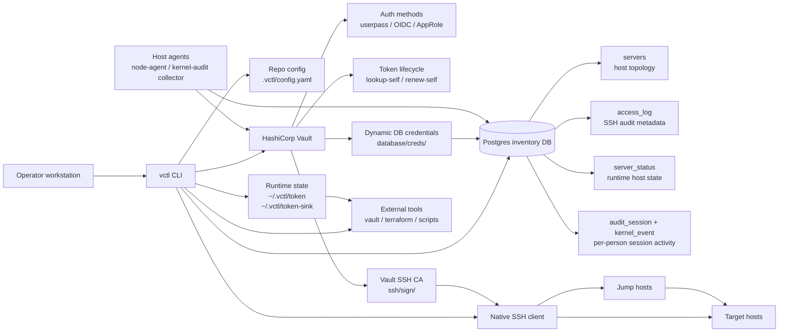
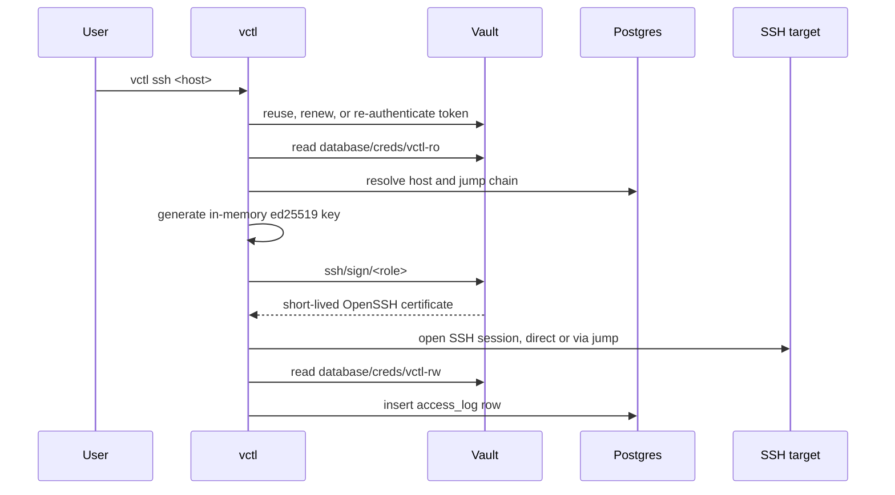

# vctl

[English README](README.md) · [한국어 README](README.ko.md)

`vctl` は Vault をバックエンドとするインフラアクセス CLI です。Vault トークンを直接管理し、Vault SSH CA を通じて短命の SSH 証明書に署名し、Postgres からホストインベントリを読み取り、中央の SSH アクセス監査メタデータを記録します。

- ローカルデーモン不要: バイナリ自身がログイン、更新、再認証、SSH 証明書署名を処理します。
- トークンライフサイクル管理: 有効期限前に更新し、更新が不可能になった場合は AppRole で再認証します。
- ツール連携: `vctl token`、`vctl exec`、`vctl agent` のシンクファイルを通じてトークンを公開します。
- 組み込みプライベート CA: ワークステーションに追加設定をせずに Vault と Postgres の TLS を検証します。
- 静的 SSH 鍵なし: 接続ごとにメモリ上で鍵を生成し、短命の証明書を要求します。
- 中央インベントリ: シークレットは Vault に保持したまま、ホストトポロジとアクセス監査メタデータを Postgres に格納します。
- ホストエージェント(任意): 低リソースのデーモンが、ログインした本人に紐づけて、個人単位のカーネルセッション活動とホストの稼働状況を Postgres に報告します。エージェントレスな Vault パターンをサーバー側に適用したものです。
- 堅牢化されたリリース経路: CI がテスト、Trivy スキャン、distroless イメージスキャン、GoReleaser、Homebrew 更新、GHCR 公開を実行します。

## Architecture



信頼境界はシンプルです。機密性のある資格情報はすべて Vault が発行し、Postgres はインベントリと監査メタデータのみを格納し、`vctl` は SSH 秘密鍵をメモリ上にのみ保持します。ランタイムトークンは制限の厳しいファイルパーミッションで `~/.vctl/` の下にキャッシュされます。

## Runtime Flow



## Vault Agent Replacement

```bash
# Provide a token to the existing vault CLI.
export VAULT_TOKEN=$(vctl token)
vault kv get kv/services/foo

# Inject VAULT_TOKEN and VAULT_ADDR into a child process.
vctl exec -- terraform apply
vctl exec -- vault kv get kv/services/foo

# The child process receives the token value from startup time.
# Renewing the same token keeps it valid, but if max_ttl forces a new token,
# the child process cannot receive the replacement through its environment.
# For very long-running jobs, use the sink file mode below.

# Keep a token sink file updated.
vctl agent --sink /run/user/$(id -u)/vault-token
VAULT_TOKEN=$(cat ~/.vctl/token-sink) vault kv get kv/services/foo
```

非対話的な環境では AppRole の資格情報を指定します。

```bash
export VCTL_ROLE_ID_FILE=/etc/vctl/role_id
export VCTL_SECRET_ID_FILE=/etc/vctl/secret_id
vctl agent
```

## Vault Agent Mapping

| Vault Agent concept | vctl command | Notes |
|---|---|---|
| auto-auth | `login` or AppRole env | CLI での 1 回のログイン、または非対話的な AppRole 認証 |
| token sink | `vctl agent --sink` | 他のツール向けにトークンファイルを書き出す |
| auto-renew | built into commands and `agent` | 有効期限前に更新する |
| `agent exec` | `vctl exec --` | 子プロセスの実行中はトークンを生かし続ける |
| caching proxy | not supported | vctl はトークン供給と SSH アクセスに専念する |

## New User Flow

```bash
# Install
brew install ghdwlsgur/vctl/vctl

# Login — GitLab SSO by default (per-person identity), zero config needed
vctl login

# Connect
vctl ssh sre-srv-0047
vctl ssh 0047
vctl ssh
vctl list

# Review access history
vctl audit
vctl audit --detail
vctl audit --source-ip 192.0.2.10
```

コンテナイメージは GitHub Container Registry に公開されています。

```bash
docker pull ghcr.io/ghdwlsgur/vctl:latest
docker run --rm ghcr.io/ghdwlsgur/vctl:latest --version
```

`vctl` はコンパイル時のデフォルト値で動作します。リポジトリローカルの設定は `.vctl/config.yaml` に置かれ、ランタイムのトークンキャッシュファイルは `~/.vctl/` の下に置かれます。

## Authentication

ログインする主体に応じて方式を選びます。アイデンティティは個人単位を保たなければなりません。監査証跡(access_log、SSH 証明書の key-id、Vault 監査)は Vault が認証した本人に紐づくため、複数人で 1 つのアイデンティティを共有してはいけません。

| Method | Who | Notes |
|---|---|---|
| **`oidc` (GitLab SSO)** | **People (default)** | 各ユーザーが `gitlab.sre.local` を通じて本人としてログインします。個人単位のアイデンティティがすべての監査レコードに流れ込みます。ブラウザセッションにより再認証は軽量です。`vctl login` はフラグや設定なしでこれを使用します。 |
| `approle` | Services / automation | 非対話的(role_id + secret_id)。共有 approle は 1 つのアイデンティティであり、デーモン(例: 監査コレクター)には適していますが、複数人での利用には**適しません**。 |
| `userpass` | Fallback / bootstrap | 個人単位ですが、毎回手動でパスワードを入力します。 |

### GitLab SSO (OIDC)

```bash
vctl login                      # OIDC is the default -> opens a browser -> GitLab SSO
vctl ssh sre-srv-0047
vctl audit -n 3                 # VAULT USER column shows your GitLab username
```

(bootstrap には `vctl login --method userpass` を使うか、`auth_method: userpass` を設定して上書きします。)

Vault の `oidc` 認証バックエンドは GitLab をアイデンティティプロバイダとして信頼します。ロールは GitLab の `preferred_username` クレームをトークンにマッピングするため、`vctl audit` と Vault の監査デバイスはロール名ではなく実際の本人を記録します。トークンの有効期限は、パスワードの再入力ではなく素早い SSO のラウンドトリップで再充足されます。

> Vault/IaC 側(オペレーターによる一度きりの作業): GitLab アプリケーション(Confidential、`openid profile email`、リダイレクト URI は `http://localhost:8250/oidc/callback` と Vault UI のコールバック)が client_id/secret を提供し、これは `kv/services/vault-oidc-gitlab` に格納されます。OIDC バックエンドとロールは `vault-iac` リポジトリにあります(`enable_gitlab_oidc=true`)。

## Access Control (RBAC)

認可は 2 層構成です。

**第 1 層 — Vault(粗い、ブートストラップ用)。** 認証されたすべてのユーザーは `vctl-user`(SSH 証明書署名の権限 + インベントリの読み取り)を取得します。GitLab の `vctl-admins` グループ、または組織の `sre` グループへの所属は `vctl-admin` にマッピングされ、インベントリの書き込み、CA 操作、RBAC 管理が追加されます。Vault は admin と user を区別するだけで、個々のコマンドはゲートしません。(GitLab の*インスタンス*管理者は OIDC クレームではないため、admin は admin フラグではなくグループ所属によって付与されます。)

**第 2 層 — アプリ(細かい、admin 管理)。** 非 admin が実行できるコマンドは `vctl rbac` で決定され、Postgres に集中管理され、各コマンドの実行前に強制されます。

- 読み取りコマンド(`list`、`status`、`audit`、`session`)はデフォルトで許可されます。
- 変更/接続コマンド(`ssh`、`exec`、`sync`、`prune`、`trust-ca`)は、グループが付与するまで拒否されます。
- `vctl-admin`(および `sre-admin`)はアプリ層をバイパスするため、admin が締め出されることはありません。

admin は対話的なピッカーを使って CLI から管理します。

```bash
vctl rbac group create devs        # create a group
vctl rbac assign [devs]            # pick a group -> multi-select users to add
vctl rbac grant  [devs]            # pick a group -> multi-select commands (ssh, sync, … or *)
vctl rbac whoami                   # your identity, admin status, groups, granted commands
vctl rbac users                    # everyone who has logged in, with their vctl version
```

`assign` の候補ユーザーは、ログイン済みの全員(`vctl login` がアイデンティティを記録します)と既存メンバーから取得されるため、新しいチームメイトは一度ログインすれば現れます。`vctl ssh` は依然として第 1 層の対象でもあります。トークンが署名権限を持っている必要があり(`vctl-user` を通じて持っています)、残りはアプリのゲートが決定します。

## SSH Flow

```text
vctl ssh <host>
  -> reuse or refresh a Vault token
  -> read database/creds/vctl-ro for short-lived Postgres credentials
  -> resolve the host and jump chain from Postgres inventory
  -> generate an in-memory ed25519 key
  -> request a short-lived certificate from ssh/sign/<role>
  -> open a native SSH session with direct or jump-chain routing
  -> write a best-effort access_log row with source/client/target metadata
```

ホストが Vault SSH CA を信頼して初めて、これらの証明書を受け入れます。新しいホストは `vctl trust-ca` で一度オンボーディングします(通常の SSH 接続を通じて CA 公開鍵を `TrustedUserCAKeys` としてインストールし、sshd を再読み込みします)。

```bash
vctl trust-ca rnd-gitlab             # resolve user/addr from inventory
vctl trust-ca root@198.51.100.25     # or an explicit, not-yet-registered host
```

これがないと、ホストが未知の CA を拒否するため、`vctl ssh` はハンドシェイクに失敗します(`no supported methods remain`)。ゴールデンイメージに CA 鍵を焼き込んでおけば、ホストごとのオンボーディングを省略できます。

## Access Audit

`vctl ssh` は接続試行のたびに、ベストエフォートでインベントリレベルの監査行を書き込みます。この行には以下が含まれます。

- `lookup-self` による Vault アイデンティティ
- ターゲットのホスト名とターゲットアドレス
- SSH ソケットから観測されたソース IP とソースアドレス
- ローカルクライアントのホスト名と OS ユーザー
- 経由した場合の踏み台ホスト
- Vault が発行した SSH 証明書のシリアル
- 接続結果と上限付きのエラーテキスト

デフォルトの出力はコンパクトです。

```bash
vctl audit
```

詳細出力にはクライアントホスト、ソースアドレス、証明書シリアル、エラーが含まれます。

```bash
vctl audit --detail
```

ホスト、Vault ユーザー、完全一致のソース IP でフィルタリングできます。

```bash
vctl audit --host sre-srv-0047
vctl audit --user albert
vctl audit --source-ip 192.0.2.10
```

この監査テーブルは運用上のメタデータです。証明書署名要求の正式な記録は依然として Vault の監査デバイスです。

## Host Agents

2 つの任意のデーモンが、ワークステーションではなくサーバー*上で*動作します。いずれも AppRole で非対話的に認証し、狭い Vault ポリシーを保持し、短命の動的 DB 資格情報を通じて書き込みます。CLI と同じエージェントレスパターンをサーバー側に適用したものです。

| Daemon | Unit / docs | Vault policy → DB role | Writes |
|---|---|---|---|
| Kernel-audit collector + session registrar | `deploy/audit/` (`vctl-collect`, `vctl-watch-sessions`) | `vctl-collector` → `vctl-rw` | `audit_session`, `kernel_event` |
| Node status agent | `deploy/node/` (`vctl-node-agent`) | `vctl-node` → `vctl-status` | `server_status` |

**個人単位のセッション監査。** ログイン時のスタンパーが提示された SSH 証明書のシリアルを記録するため、Tetragon が捕捉したプロセス活動が、共有の OS ログインユーザーだけでなく、実際にログインした本人にリンクされます。結合されたタイムラインは以下で読み取ります。

```bash
vctl session --list                 # recent sessions (who, where, when)
vctl session <cert-serial>          # full kernel timeline for one access
vctl session <cert-serial> --json   # machine-readable export (e.g. for an agent)
```

コレクターは Tetragon から `process_exec`/`process_exit` を取り込みます。イベントは cgroup id でセッションにリンクされ、フォールバックとして証明書シリアルを使います。保持期間は `vctl prune`(CronJob)によって強制され、Teleport のストレージライフサイクルモデルを踏襲しています。大量に発生する `kernel_event` 行は、小さな `audit_session` インデックスよりも早く失効します。

**ランタイムのホスト状態。** `vctl node-agent` は軽量な生存ハートビート(負荷、メモリ、ディスク)を、*すでに `servers` に存在するホストについてのみ* `server_status` に報告します。インベントリを作成することは決してありません。`vctl list` と `vctl status` はこの鮮度をトポロジと並べて表示します。

**長時間稼働する資格情報の更新。** これらのデーモンは Postgres プールを何日も保持しますが、Vault の動的 DB 資格情報は短命です(デフォルト 1h、最大 4h)。プールはそのウィンドウの十分内側で物理接続を再生成し、接続前に有効な資格情報を再取得し、トークンが失効していれば Vault セッションを再認証します。デーモンが資格情報のリースより長生きすることはなく、Vault Agent も不要です。

リソース制限、journald の上限、ゴールデンイメージへの焼き込みに関するガイダンスは `deploy/audit/README.md` と `deploy/node/README.md` にあります。

## Commands

| Command | Description |
|---|---|
| `vctl login [--method userpass\|oidc\|approle]` | Vault にログインしてトークンをキャッシュする |
| `vctl token` | 更新または再認証後に有効な Vault トークンを出力する |
| `vctl exec -- <cmd>` | `VAULT_TOKEN` と `VAULT_ADDR` を渡して子プロセスを実行する |
| `vctl agent [--sink <path>]` | トークンを生かし続け、シンクファイルに書き出す |
| `vctl ssh [host] [--server <host>]` | 完全一致、あいまい一致、または対話的なホスト選択で接続する。`--server` は完全一致で解決し、非対話的に接続する(スクリプト/エージェント向け) |
| `vctl list [--dc <dc>]` | インベントリのホストを一覧表示する |
| `vctl rbac <group\|member\|grant\|revoke\|assign\|users\|whoami\|check>` | アプリ層のコマンド RBAC を管理する(admin)。`assign`/`grant` は対話的なピッカー |
| `vctl audit [--detail] [--host <host>] [--user <user>] [--source-ip <ip>]` | 中央の SSH アクセス監査行を表示する |
| `vctl trust-ca <host\|user@addr> [--sudo] [-i <key>]` | vctl ssh が動作するようホストに Vault SSH CA の信頼をインストールする(一度きりのオンボーディング) |
| `vctl ca install\|remove\|print` | このマシンの OS ストアで SRE ルート CA を信頼し、ブラウザ/curl が `*.sre.local` を受け入れるようにする(HSTS エラーを解消)。プラットフォームは自動検出 |
| `vctl node-agent [--interval 5m]` | すでに登録済みのインベントリについて軽量なホストのランタイム状態を報告する |
| `vctl session [<serial>\|--list\|--json]` | SSH セッション内で誰が何をしたかを表示する(ホストのカーネル監査タイムライン) |
| `vctl status` | ログイン、SSH CA、インベントリ DB の接続性を確認する |
| `vctl sync [--migrate] [--prefix sre]` | `~/.ssh/config` とプローブからインベントリを同期する |
| `vctl logout` | キャッシュされた Vault トークンを削除する |

## Configuration

`VAULT_ADDR`、`VCTL_AUTH_METHOD`、`VCTL_ROLE_ID_FILE`、`VCTL_SECRET_ID_FILE`、`VCTL_SINK`、`VCTL_DB_HOST`、`VCTL_CA_ROLE`、`VCTL_SSH_DEFAULT_USER`、`VCTL_SSH_DIRECT_FIRST`、`VCTL_SYNC_PROBE_TIMEOUT`、`VCTL_SYNC_PROBE_CONCURRENCY` などの環境変数で、コンパイル時のデフォルト値を上書きできます。

設定ファイルは**任意**です。vctl はコンパイル時のデフォルト値で動作し、ログイン時にファイルは作成されません。値を上書きする必要があるときだけサンプルをコピーし(例: OIDC デフォルトを上書きする `auth_method: userpass`)、変更するキーだけを残してください。シークレットは一切入れません。Vault がランタイムにトークンと DB 資格情報を発行します。

```bash
mkdir -p .vctl
cp .vctl/config.example.yaml .vctl/config.yaml   # then trim to what you override
```

すべてのキーとそのコンパイル時デフォルト値:

```yaml
vault_addr: https://vault.sre.local
auth_method: oidc # people: GitLab SSO (per-person). userpass/approle also supported.
oidc_role: vctl
oidc_mount: oidc

db_host: vctl-postgres.sre.local
db_port: 5432
db_name: vctl
db_role_ro: vctl-ro
db_role_rw: vctl-rw
db_role_status: vctl-status
db_role_migrate: vctl-migrator
db_migration_owner: vctl_owner

ca_role: sre-core
ssh_sign: 30m
ssh_direct_first: true
ssh_default_user: ubuntu

sync_probe_timeout: 3s
sync_probe_concurrency: 32
dc_rules:
  - name: incheon
    prefixes: ["10.40.0.", "192.168.10."]
  - name: seoul-onprem
    prefixes: ["192.168.201.", "192.168.190.", "192.168.110."]
```

踏み台のみの環境では `ssh_direct_first: false` を設定すると、直接 SSH 接続の試行をスキップし、設定された踏み台チェーンを使う前に直接接続のタイムアウトを待たずに済みます。

`vctl node-agent` は任意です。すでに `servers` に存在するホストについて観測したホスト状態を `server_status` に報告し、インベントリ行を作成することは決してありません。サーバーにインストールする際は、`deploy/vault/` の専用の `vctl-node` Vault ポリシーと `vctl-status` DB ロールを使ってください。低リソースの systemd ユニットが `deploy/node/` の下に用意されています。

## Admin Bootstrap

```bash
# Configure the Vault DB engine, roles, and policies.
PG_ADMIN_PASS=<root-password> ./deploy/vault/setup.sh

# Create a userpass account for a teammate.
vault write auth/userpass/users/<id> password=<once> policies=vctl-user

# Initial inventory load with a vctl-admin token.
vctl sync --migrate
```

OIDC のセットアップは [deploy/vault/oidc-phase2.md](deploy/vault/oidc-phase2.md) に記載されています。

## Build And Verify

```bash
make build
make test
make vet
make trivy
```

`make trivy` は Go の依存関係、リポジトリのシークレット、Dockerfile の設定ミスをスキャンします。CI もリリース公開前に distroless イメージをスキャンします。

## Release

リリースは Git タグをプッシュすることで公開されます。GoReleaser が GitHub Release のアーティファクトを作成し、`ghdwlsgur/homebrew-vctl` リポジトリの `Formula/vctl.rb` を更新し、distroless イメージを `ghcr.io/ghdwlsgur/vctl` に公開します。

必要なリポジトリシークレット:

```text
HOMEBREW_TAP_GITHUB_TOKEN
```

このトークンは `ghdwlsgur/homebrew-vctl` へのプッシュを許可されている必要があります。

```bash
git tag -a v0.1.7 -m "Release v0.1.7"
git push origin v0.1.7
```

リリースワークフローは固定された GitHub Actions を使い、テストと Trivy を実行し、distroless イメージをスキャンし、GitHub Release のアーティファクトを公開し、Homebrew を更新し、GHCR タグをプッシュします。

## Security Notes

- インベントリにはトポロジのみが含まれます。証明書、Vault トークン、DB 資格情報は短命で、Vault が発行します。
- ランタイムのトークンファイルは、制限の厳しいパーミッションで `~/.vctl/` または設定されたシンクパスの下に書き込まれます。通常ファイルでないシンクターゲットは拒否されます。
- OIDC コールバックの処理はループバックにバインドし、コールバックの state を検証し、HTTP ヘッダのタイムアウトを使用します。
- SSH 秘密鍵は接続ごとにメモリ上で生成され、ディスクには書き込まれません。
- Postgres 接続は短命の Vault 発行資格情報を使い、組み込み CA で verify-full TLS を検証します。
- GitHub Actions はコミット SHA に固定され、リリース自動化は固定された GoReleaser のメジャーバージョンを使用します。

## Design Notes

- Vault は、認証、トークン更新、SSH 証明書署名、動的 DB 資格情報、署名監査ログの信頼できる唯一の情報源です。
- Postgres は中央インベントリと運用上のアクセス監査メタデータを格納します。
- SSH CA 鍵のローテーションと DB 資格情報のローテーションは独立しています。
- 長時間稼働する接続プールは動的資格情報のリースウィンドウ内で再生成し、接続ごとに資格情報を再取得するため、ホストデーモンが失効したリースを再利用することはありません。
- コンパイル時のデフォルト値はあくまでオンボーディング用のデフォルトです。Vault、DB、CA ロール、SSH ユーザー、direct-first の挙動、sync のプローブ、DC 分類は、環境変数または `.vctl/config.yaml` で上書きしてください。

## Layout

```text
cmd/vctl              entrypoint
cmd/dbedit            maintenance tool for operator-managed inventory columns (dc)
internal/config       generic loader (config.go) + org-specific defaults (defaults_sre.go) + embedded CA
internal/vaultc       Vault auth, token lifecycle, SSH signing, DB credentials, CA reads
internal/store        Postgres inventory, app-layer RBAC, access/session/kernel audit, host status (verify-full TLS)
internal/sshc         native SSH client with cert signer, jump chains, PTY, and connection metadata
internal/syncx        ssh config parsing and host probing
internal/hoststatus   node-agent host metrics collection (/proc, syscall) with pure, testable parsers
internal/strutil      tiny shared string helpers
internal/cli          Cobra commands (incl. app-layer RBAC: vctl rbac)
deploy/vault          policies (incl. RBAC vctl-admin/user + vctl-admins group), DB engine bootstrap, OIDC guide
deploy/audit          host kernel-audit stack: collector, session registrar, Tetragon, retention
deploy/node           host node-agent systemd unit and install notes
```
