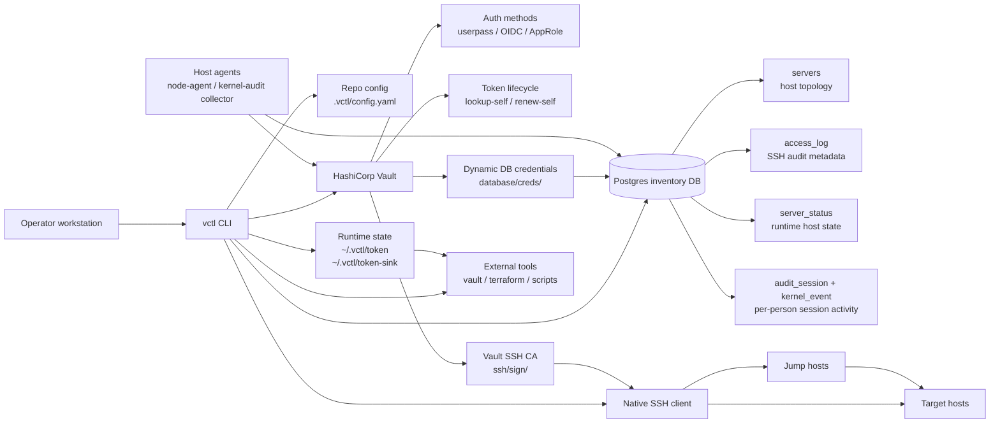
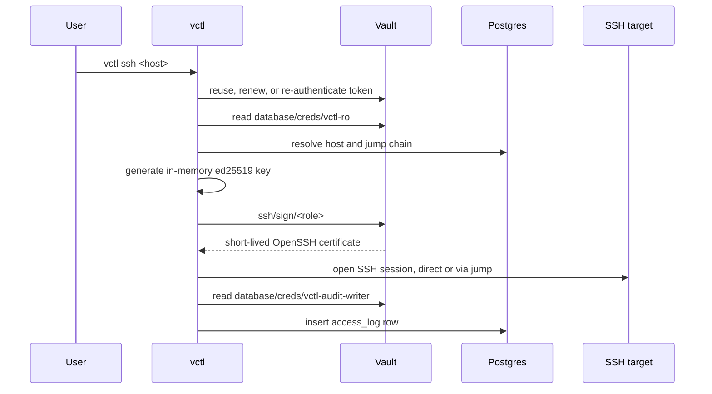

# vctl

[English README](README.md) · [한국어 README](README.ko.md)

`vctl` は Vault をバックエンドとするインフラアクセス CLI です。Vault トークンを直接管理し、Vault SSH CA を通じて短命の SSH 証明書に署名し、Postgres からホストインベントリを読み取り、中央の SSH アクセス監査メタデータを記録します。

- ローカルデーモン不要: バイナリ自身がログイン、更新、再認証、SSH 証明書署名を処理します。
- トークンライフサイクル管理: 有効期限前に更新し、更新が不可能になった場合は AppRole で再認証します。
- ツール連携: `vctl token`、`vctl exec`、`vctl agent` のシンクファイルを通じてトークンを公開します。
- 組み込みプライベート CA: ワークステーションに追加設定をせずに Vault と Postgres の TLS を検証します。
- 静的 SSH 鍵なし: 接続ごとにメモリ上で鍵を生成し、短命の証明書を要求します。
- 中央インベントリ: シークレットは Vault に保持したまま、ホストトポロジとアクセス監査メタデータを Postgres に格納します。
- ホストエージェント(任意): 低リソースのデーモンが、ログインした本人に紐づけて、個人単位のカーネルセッション活動とホストの稼働状況を Postgres に報告します。エージェントレスな Vault パターンをサーバー側に適用したものです。
- 堅牢化されたリリース経路: CI がテスト、Trivy スキャン、distroless イメージスキャン、GoReleaser、Homebrew 更新、GHCR 公開を実行します。

## Architecture


```mermaid
flowchart LR
  user[Operator workstation] --> cli[vctl CLI]

  cli --> cfg[Repo config\n.vctl/config.yaml]
  cli --> cache[Runtime state\n~/.vctl/token\n~/.vctl/token-sink]

  cli --> vault[HashiCorp Vault]
  vault --> auth[Auth methods\nuserpass / OIDC / AppRole]
  vault --> token[Token lifecycle\nlookup-self / renew-self]
  vault --> sshca[Vault SSH CA\nssh/sign/<role>]
  vault --> dbcreds[Dynamic DB credentials\ndatabase/creds/<role>]

  cli --> pg[(Postgres inventory DB)]
  dbcreds --> pg
  pg --> inv[servers\nhost topology]
  pg --> audit[access_log\nSSH audit metadata]
  pg --> status[server_status\nruntime host state]
  pg --> sess[audit_session + kernel_event\nper-person session activity]

  agents[Host agents\nnode-agent / kernel-audit collector] --> vault
  agents --> pg

  cli --> ssh[Native SSH client]
  sshca --> ssh
  ssh --> target[Target hosts]
  ssh --> jump[Jump hosts]
  jump --> target

  cli --> tools[External tools\nvault / terraform / scripts]
  cache --> tools
```

信頼境界はシンプルです。機密性のある資格情報はすべて Vault が発行し、Postgres はインベントリと監査メタデータのみを格納し、`vctl` は SSH 秘密鍵をメモリ上にのみ保持します。ランタイムトークンは制限の厳しいファイルパーミッションで `~/.vctl/` の下にキャッシュされます。

## Runtime Flow


```mermaid
sequenceDiagram
  participant User
  participant VCTL as vctl
  participant Vault
  participant PG as Postgres
  participant SSH as SSH target

  User->>VCTL: vctl ssh <host>
  VCTL->>Vault: reuse, renew, or re-authenticate token
  VCTL->>Vault: read database/creds/vctl-ro
  VCTL->>PG: resolve host and jump chain
  VCTL->>VCTL: generate in-memory ed25519 key
  VCTL->>Vault: ssh/sign/<role>
  Vault-->>VCTL: short-lived OpenSSH certificate
  VCTL->>SSH: open SSH session, direct or via jump
  VCTL->>Vault: read database/creds/vctl-audit-writer
  VCTL->>PG: insert access_log row
```

## Vault Agent Replacement

```bash
# Provide a token to the existing vault CLI.
export VAULT_TOKEN=$(vctl token)
vault kv get kv/services/foo

# Inject VAULT_TOKEN and VAULT_ADDR into a child process.
vctl exec -- terraform apply
vctl exec -- vault kv get kv/services/foo

# The child process receives the token value from startup time.
# Renewing the same token keeps it valid, but if max_ttl forces a new token,
# the child process cannot receive the replacement through its environment.
# For very long-running jobs, use the sink file mode below.

# Keep a token sink file updated.
vctl agent --sink /run/user/$(id -u)/vault-token
VAULT_TOKEN=$(cat ~/.vctl/token-sink) vault kv get kv/services/foo
```

非対話的な環境では AppRole の資格情報を指定します。

```bash
export VCTL_ROLE_ID_FILE=/etc/vctl/role_id
export VCTL_SECRET_ID_FILE=/etc/vctl/secret_id
vctl agent
```

## Vault Agent Mapping

| Vault Agent concept | vctl command | Notes |
|---|---|---|
| auto-auth | `login` or AppRole env | CLI での 1 回のログイン、または非対話的な AppRole 認証 |
| token sink | `vctl agent --sink` | 他のツール向けにトークンファイルを書き出す |
| auto-renew | built into commands and `agent` | 有効期限前に更新する |
| `agent exec` | `vctl exec --` | 子プロセスの実行中はトークンを生かし続ける |
| caching proxy | not supported | vctl はトークン供給と SSH アクセスに専念する |

## New User Flow

```bash
# Install
brew install ghdwlsgur/vctl/vctl

# Login — GitLab SSO by default (per-person identity), zero config needed
vctl login

# Connect
vctl ssh sre-srv-0047
vctl ssh 0047
vctl ssh
vctl list

# Review access history
vctl audit
vctl audit --detail
vctl audit --source-ip 192.0.2.10
```

コンテナイメージは GitHub Container Registry に公開されています。

```bash
docker pull ghcr.io/ghdwlsgur/vctl:latest
docker run --rm ghcr.io/ghdwlsgur/vctl:latest --version
```

`vctl` はコンパイル時のデフォルト値で動作します。リポジトリローカルの設定は `.vctl/config.yaml` に置かれ、ランタイムのトークンキャッシュファイルは `~/.vctl/` の下に置かれます。

## Authentication

ログインする主体に応じて方式を選びます。アイデンティティは個人単位を保たなければなりません。監査証跡(access_log、SSH 証明書の key-id、Vault 監査)は Vault が認証した本人に紐づくため、複数人で 1 つのアイデンティティを共有してはいけません。

| Method | Who | Notes |
|---|---|---|
| **`oidc` (GitLab SSO)** | **People (default)** | 各ユーザーが組織の GitLab を通じて本人としてログインします。個人単位のアイデンティティがすべての監査レコードに流れ込みます。ブラウザセッションにより再認証は軽量です。`vctl login` はフラグや設定なしでこれを使用します。 |
| `approle` | Services / automation | 非対話的(role_id + secret_id)。共有 approle は 1 つのアイデンティティであり、デーモン(例: 監査コレクター)には適していますが、複数人での利用には**適しません**。 |
| `userpass` | Fallback / bootstrap | 個人単位ですが、毎回手動でパスワードを入力します。 |

### GitLab SSO (OIDC)

```bash
vctl login                      # OIDC is the default -> opens a browser -> GitLab SSO
vctl ssh sre-srv-0047
vctl audit -n 3                 # VAULT USER column shows your GitLab username
```

(bootstrap には `vctl login --method userpass` を使うか、`auth_method: userpass` を設定して上書きします。)

Vault の `oidc` 認証バックエンドは GitLab をアイデンティティプロバイダとして信頼します。ロールは GitLab の `preferred_username` クレームをトークンにマッピングするため、`vctl audit` と Vault の監査デバイスはロール名ではなく実際の本人を記録します。トークンの有効期限は、パスワードの再入力ではなく素早い SSO のラウンドトリップで再充足されます。

> Vault/IaC 側(オペレーターによる一度きりの作業): GitLab アプリケーション(Confidential、`openid profile email`、リダイレクト URI は `http://localhost:8250/oidc/callback` と Vault UI のコールバック)が client_id/secret を提供し、これは `kv/services/vault-oidc-gitlab` に格納されます。OIDC バックエンドとロールは `vault-iac` リポジトリにあります(`enable_gitlab_oidc=true`)。

## Access Control (RBAC)

認可は Vault の強制境界と CLI の追加制限で構成されます。

**第 1 層 — Vault(強制境界)。** 全ユーザーの `vctl-user` はインベントリ/RBAC 読み取りのみです。`vctl-ssh-users` は `vctl-ssh`、`vctl-auditors` は `vctl-auditor`、`vctl-admins` は管理 + SSH + 監査ポリシーを取得します。Vault policy/Identity の管理は自己昇格を防ぐため Terraform/プラットフォーム管理者に限定します。

**第 2 層 — アプリ(追加制限)。** `vctl rbac` の Postgres grant を標準 CLI がコマンド実行前に検査します。

- 読み取りコマンド(`list`、`status`、`audit`、`session`)はデフォルトで許可されます。
- 変更/接続コマンド(`ssh`、`exec`、`sync`、`trust-ca`)は、グループが付与するまで拒否されます。
- `vctl-admin`(および `sre-admin`)はアプリ層をバイパスするため、admin が締め出されることはありません。

admin は対話的なピッカーを使って CLI から管理します。

```bash
vctl rbac group create devs        # create a group
vctl rbac assign [devs]            # pick a group -> multi-select users to add
vctl rbac grant  [devs]            # pick a group -> multi-select commands (ssh, sync, … or *)
vctl rbac whoami                   # your identity, admin status, groups, granted commands
vctl rbac users                    # everyone who has logged in, with their vctl version
```

`assign` の候補ユーザーはログイン済みユーザーと既存メンバーです。`vctl ssh` には Postgres grant に加えて Vault の `vctl-ssh` が必要なため、Vault API の直接呼び出しでも認可を迂回できません。

## SSH Flow

```text
vctl ssh <host>
  -> reuse or refresh a Vault token
  -> read database/creds/vctl-ro for short-lived Postgres credentials
  -> resolve the host (by hostname, or by IP — primary/extra/observed) and jump chain from Postgres inventory
  -> generate an in-memory ed25519 key
  -> request a short-lived certificate from ssh/sign/<role>
  -> open a native SSH session with direct or jump-chain routing
  -> write a best-effort access_log row with source/client/target metadata
```

未知の SSH host key は対話モードで fingerprint の確認が必要です。非対話の
`--server` は未知の key を拒否するため、自動化前に信頼できる経路で
`~/.ssh/known_hosts` を準備してください。MCP サーバ(`vctl mcp`)は未知の key を
初回接続時に記録(accept-new)し、エージェントがオンボーディング直後のホストにも
到達できるようにします。ただし*不一致*の既知 key は常に拒否します。

複数のアドレス(プライマリ NIC に加えてフローティング VIP や追加 NIC)を持つホストは、
そのいずれでも到達できます。`vctl ssh --server <ip>` はプライマリ `ip`、運用者が設定した
`extra_ips`(`dbedit -col ips`)、node-agent の `observed_ips` のいずれかに一致し、
`vctl list` が追加 IP も表示します。対話ピッカーは ←/→ でデータセンター別に絞り込めます。

ホストが Vault SSH CA を信頼して初めて、これらの証明書を受け入れます。新しいホストは `vctl trust-ca` で一度オンボーディングします(通常の SSH 接続を通じて CA 公開鍵を `TrustedUserCAKeys` としてインストールし、sshd を再読み込みします)。

```bash
vctl trust-ca rnd-gitlab             # resolve user/addr from inventory
vctl trust-ca root@198.51.100.25     # or an explicit, not-yet-registered host
```

これがないと、ホストが未知の CA を拒否するため、`vctl ssh` はハンドシェイクに失敗します(`no supported methods remain`)。ゴールデンイメージに CA 鍵を焼き込んでおけば、ホストごとのオンボーディングを省略できます。

## Access Audit

`vctl ssh` は接続試行のたびに、ベストエフォートでインベントリレベルの監査行を書き込みます。この行には以下が含まれます。

- `lookup-self` による Vault アイデンティティ
- ターゲットのホスト名とターゲットアドレス
- SSH ソケットから観測されたソース IP とソースアドレス
- ローカルクライアントのホスト名と OS ユーザー
- 経由した場合の踏み台ホスト
- Vault が発行した SSH 証明書のシリアル
- 接続結果と上限付きのエラーテキスト

デフォルトの出力はコンパクトです。

```bash
vctl audit
```

詳細出力にはクライアントホスト、ソースアドレス、証明書シリアル、エラーが含まれます。

```bash
vctl audit --detail
```

ホスト、Vault ユーザー、完全一致のソース IP でフィルタリングできます。

```bash
vctl audit --host sre-srv-0047
vctl audit --user albert
vctl audit --source-ip 192.0.2.10
```

この監査テーブルは運用上のメタデータです。証明書署名要求の正式な記録は依然として Vault の監査デバイスです。

## Postgres 障害時の動作

インベントリ DB は RWO ボリュームに紐づく Postgres の単一インスタンスです。ここが落ちるとホスト検索もまとめて使えなくなります。SSH 証明書を発行する Vault のほうは無事なのに、です。そこで `vctl` はインベントリの読み取り専用スナップショットをローカルに保持し、その間も `vctl ssh` と `vctl list` が動くようにしています。

**書き込みは変わりません。** スナップショットには信頼できる情報源となるものを一切書きません。`sync`、RBAC 管理を含むすべての変更は従来どおり Postgres にのみ向かい、DB が落ちていれば従来どおり明示的に失敗します。

```bash
vctl cache status     # スナップショットの経過時間、ホスト数、オフライン grant の有効期間、キューされた監査レコード
vctl cache refresh    # 今すぐ更新 — 接続を失う直前に使います
vctl cache clear      # スナップショットとキャッシュされた grant を削除
```

動作:

- **更新は自動です。** オンライン時の `vctl ssh` や `vctl list` は、スナップショットが `cache_refresh`(既定 5m)を超えていれば自動で更新します。別途 sync を実行する必要はありません。ホストが 0 件で返ってきた取得は保存せず拒否します。空の結果は設定ミスによる読み取りと区別がつかず、正常なスナップショットを空で上書きすると、最も必要なときにフォールバックが失われます。
- **古いデータはそう表示します。** キャッシュから読むとスナップショットの経過時間とともに警告が出て、liveness 列は up/stale ではなく `?` になります。スナップショットは「このホストは今生きているか」に答えられません。すべてを stale と表示すれば、DB 障害を agent のせいにすることになります。
- **Vault は依然として必要です。** スナップショットが代替するのは Postgres であって Vault ではありません。`vctl ssh` には有効な証明書署名が必要で、token policy は決してキャッシュしません。この仕組みが対応するのは「Postgres 停止、Vault 正常」— 実際に起きた障害です。
- **障害中に無駄なログインをさせません。** store を開く際は dial より先に認証が走るため、token が切れていると SSO のプロンプトが出たあとで「DB に到達できない」と分かる、という順序でした。現在はプロンプトだけが障壁になる場合に限り DB を先に確認し、応答がなければスナップショットを使います。有効な token か AppRole 認証情報があれば避けるべきプロンプトが無いので、この確認は実行されず従来どおりの経路です。
- **古すぎるスナップショットは使わず拒否します。** `cache_max_age`(既定 7d)を超えるとホスト検索は理由とともに失敗します。スナップショットは 1 時間ごとに更新されるため、この上限に近い古さはすでに DB へ 1 週間到達できていないことを意味します。その間に再割り当てされたかもしれないトポロジで接続させるより、止めるほうが安全です。`cache_max_age: "0"` で制限を解除できます。
- **監査レコードは捨てずに貯めます。** access_log の書き込みが Postgres に届かないときは `~/.vctl/spool/access.jsonl` に記録し、次に監査書き込みが成功したタイミングで送ります。時刻は flush 時刻ではなく実際の接続時刻を保持します。待機件数は `vctl cache status` で確認できます。
- **RBAC は fail-closed です。** 以下を参照してください。

### オフラインでの認可

コマンドの grant もインベントリと一緒にキャッシュします。そうしないと DB が一瞬途切れるたびにすべての mutate コマンドが止まってしまうからです。その代わり degraded モードはオンライン経路より**すべての段階で厳しく**してあります。自分の DB をわざと遮断してオンライン時より多くの権限を得る経路があってはならないからです。

| | オンライン | Postgres 不通 |
|---|---|---|
| Vault token policy | 都度 `lookup-self` | 都度 `lookup-self`(キャッシュしない) |
| 読み取りコマンド (`list`, `status`, `audit`) | 許可 | 許可 |
| `ssh` | grant が必要 | **Postgres が以前に確認した** grant が必要、かつ `cache_offline_ttl`(既定 24h)以内 |
| `sync`, `trust-ca`, `ip set/rm`, `wg sync` | grant が必要 | 常に拒否 — どのみち DB への書き込みが必要です |
| 管理者コマンド | admin policy が必要 | admin policy が必要 |

この有効期間は、長い障害中に取り消された grant が、一度も再接続しないノート PC で永久に生き続けないようにするためのものです。`cache_disabled: true`(または `VCTL_CACHE_DISABLE=1`)でこの仕組み全体を無効にすると、以前の fail-hard な動作にそのまま戻ります。

このキャッシュが**防げない**ものが一つあります。ユーザーが自分のスナップショットファイルを直接書き換える場合です。ローカルではどうやっても防げません。検証する側が同じマシンにいるからです。TTL が制限するのは正直な staleness であって改ざんではありません。実際に持ちこたえる境界は Vault の token policy です。policy をキャッシュせず毎回問い合わせる理由がそれであり、Vault policy が同時に塞いでいないものを app-layer RBAC だけに頼ってはいけない理由もそれです。

## Host Agents

2 つの任意のデーモンが、ワークステーションではなくサーバー*上で*動作します。いずれも AppRole で非対話的に認証し、狭い Vault ポリシーを保持し、短命の動的 DB 資格情報を通じて書き込みます。CLI と同じエージェントレスパターンをサーバー側に適用したものです。

| Daemon | Unit / docs | Vault policy → DB role | Writes |
|---|---|---|---|
| Kernel-audit collector + session registrar | `deploy/audit/` (`vctl-collect`, `vctl-watch-sessions`) | `vctl-collector` -> `vctl-audit-ingest` | `audit_session`, `kernel_event` |
| Node status agent | `deploy/node/` (`vctl-node-agent`) | `vctl-node` → `vctl-status` | `server_status` |

**個人単位のセッション監査。** ログイン時のスタンパーが提示された SSH 証明書のシリアルを記録するため、Tetragon が捕捉したプロセス活動が、共有の OS ログインユーザーだけでなく、実際にログインした本人にリンクされます。結合されたタイムラインは以下で読み取ります。

```bash
vctl session --list                 # recent sessions (who, where, when)
vctl session <cert-serial>          # full kernel timeline for one access
vctl session <cert-serial> --json   # machine-readable export (e.g. for an agent)
```

コレクターは Tetragon から `process_exec`/`process_exit` を取り込みます。イベントは cgroup id でセッションにリンクされ、フォールバックとして証明書シリアルを使います。保持期間は CronJob が強制します。テーブル所有者としてポッドローカルソケット経由でバッチ削除するため vctl は経由せず、運用者の資格情報が監査テーブルへの DELETE を持つことはありません。`vctl retention` は同じ数値をディスク使用量とあわせて読み取り専用で報告します。大量に発生する `kernel_event` 行は小さな `audit_session` インデックスより早く失効し、Teleport のストレージライフサイクルモデルを踏襲しています。

**セッションにリンクされたイベントのみを保存します。** ホストは実行するすべてについて exec/exit を出力し、Kubernetes ノードではその大半がコンテナと kubelet の生成消滅です。どのログインにも属さず、`session_id` を後から埋めるものはなく、`vctl session` はその列で結合するため、保存してもディスクを消費するだけで何も答えません。リンクできなかったイベントは `--attribution-grace`(30秒)の間保持され優先的に再試行されます。ログイン直後のコマンドはセッション行が書かれる前に届くからです。それを過ぎて初めて破棄します。`--require-session=false` で全ホストキャプチャに戻せます。`vctl collect --host` と `vctl watch-sessions --hostname` は同じインベントリ名を記録する必要があります。突合はホスト名で結合するため、片側だけ固定しても何もリンクされません。

**ランタイムのホスト状態。** `vctl node-agent` は軽量な生存ハートビート(負荷、メモリ、ディスク)を、*すでに `servers` に存在するホストについてのみ* `server_status` に報告します。インベントリを作成することは決してありません。`vctl list` と `vctl status` はこの鮮度をトポロジと並べて表示します。

**長時間稼働する資格情報の更新。** これらのデーモンは Postgres プールを何日も保持しますが、Vault の動的 DB 資格情報は短命です(デフォルト 1h、最大 4h)。プールはそのウィンドウの十分内側で物理接続を再生成し、接続前に有効な資格情報を再取得し、トークンが失効していれば Vault セッションを再認証します。デーモンが資格情報のリースより長生きすることはなく、Vault Agent も不要です。

リソース制限、journald の上限、ゴールデンイメージへの焼き込みに関するガイダンスは `deploy/audit/README.md` と `deploy/node/README.md` にあります。

## MCP (AI エージェント)

`vctl mcp` は stdio ベースの Model Context Protocol サーバ(JSON-RPC 2.0、追加依存なし)を
起動し、Claude Code のような AI エージェントがインベントリをツールとして使えるようにします。
一度だけ接続します。

```bash
claude mcp add vctl -- vctl mcp
```

| ツール | 用途 |
|---|---|
| `vctl_list` | インベントリ(hostname、プライマリ + 追加 IP、DC、user、jump、liveness)、DC フィルタ可 |
| `vctl_resolve` | hostname(あいまい)または IP(primary/extra/observed)をレコードに解決 |
| `vctl_whoami` | 現在の識別情報、ポリシー、管理者か、許可された RBAC コマンド |
| `vctl_access_log` | 最近の SSH アクセス記録(監査読み取り権限が必要) |
| `vctl_ssh_exec` | ホストでコマンドを SSH 実行し stdout/stderr/exit を返す |

ツールは現在の vctl 識別情報で動作するため、Vault ポリシーとアプリ層 RBAC がそのまま適用されます。
`vctl_ssh_exec` は `vctl ssh` と同じくゲートされ(Vault `vctl-ssh` ポリシー + アプリ RBAC `ssh`)、
同じ jump chain で Vault 署名証明書を用いて接続します。認証は AppRole に固定され、セッションが
失効すると非対話的に再認証するかエラーになるだけで、stdio チャネルを壊すログインプロンプトを
出しません。読み取り専用 AppRole は SSH 証明書に署名できないため、`vctl_ssh_exec` には ssh
可能なアクティブセッション(`vctl login`)が必要です。読み取りツールはどちらでも動作します。

## Commands

| Command | Description |
|---|---|
| `vctl login [--method userpass\|oidc\|approle\|kubernetes]` | Vault にログインしてトークンをキャッシュする。`kubernetes` は Pod の ServiceAccount トークンを交換するため、クラスタ内のジョブに保存する資格情報は不要 |
| `vctl token` | 更新または再認証後に有効な Vault トークンを出力する |
| `vctl exec -- <cmd>` | `VAULT_TOKEN` と `VAULT_ADDR` を渡して子プロセスを実行する |
| `vctl agent [--sink <path>]` | トークンを生かし続け、シンクファイルに書き出す |
| `vctl ssh [host\|user@addr] [--server <host>]` | 完全一致、あいまい一致、IP、対話的な選択で接続する(ピッカーは ←/→ で DC フィルタ)。`--server` は完全一致または IP で解決し、非対話的に接続する(スクリプト/エージェント向け). `user@addr` 形式はインベントリを経由せずアドレスへ直接接続する |
| `vctl list [--dc <dc>]` | インベントリのホストを一覧表示する(プライマリ + 追加 IP、非標準 SSH ポート、観測された liveness、および `active` でない場合の運用状態) |
| `vctl openstack [--farm <id>] [--role <role>] [--wide] [--all] [--json]` | どのホストが OpenStack を動かし、どの役割で、どのファームに属するかを表示する。node-agent の capability probe の結果を読む。`vctl openstack host <name>` は 1 台の役割・コンポーネントのバージョン・所属を表示する |
| `vctl openstack reconcile [--farm <id>] [--dry-run] [--insecure]` | 各デプロイのコントロールプレーンにどのホストが自分のものかを問い合わせ、両者が一致したホストを `confirmed` に昇格する。認証情報は Vault の `kv/teams/sre/vctl-<host_port>` から読む(フィールド: `auth_url`・`username`・`password`、任意で `project_name`・`user_domain`・`project_domain`) |
| `vctl openstack farm name [deployment] [name]` | デプロイに人が読める名前を付ける。一覧が `172.16.0.10:5000` ではなく `incheon` と表示される。引数を省略すると一覧から選び、フォームで入力する |
| `vctl openstack farm show [deployment]` | 1 つのファームのアーキテクチャを 1 画面に: ロール別セクション(コントロールプレーン先頭)・リリースドリフト・未確定メンバーシップ。引数を省略すると一覧から選ぶ |
| `vctl openstack vm [--farm <f>] [--host <h>] [--id <uuid>] [--address <ip>] [--missing]` | デプロイごとの VM と、それぞれが載る物理ホスト。`--host` はインベントリのホスト名、`--id` は Nova UUID または Kubernetes の `providerID`(`openstack:///<uuid>`)、`--address` はその IP を持つ VM を探す |
| `vctl add [flags]` | `sync` が発見できないホストをインベントリに登録する。フラグなしで実行するとフォームで入力する |
| `vctl edit [host] [flags]` | `sync` が上書きしないフィールドを変更する — dc・ssh user・踏み台・追加 IP・ホスト名、および `--state active\|maintenance\|broken\|retired`。ホストを省略すると一覧から選ぶ(←/→ で DC フィルタ) |
| `vctl delete [host] [--yes]` | 廃止したホストを削除する。監査履歴は残る。このホストを経由するホストがあれば削除を拒否する。ホストを省略すると一覧から選ぶ(←/→ で DC フィルタ) |
| `vctl mcp` | インベントリを AI エージェントに公開する読み取り専用 MCP サーバ(stdio)。`vctl_ssh_exec` でホストのコマンド実行も可能。呼び出し元の識別情報で動作 — RBAC 適用 |
| `vctl rbac <group\|member\|grant\|revoke\|assign\|users\|whoami\|check>` | アプリ層のコマンド RBAC を管理する(admin)。`assign`/`grant` は対話的なピッカー |
| `vctl audit [--detail] [--host <host>] [--user <user>] [--source-ip <ip>]` | 中央の SSH アクセス監査行を表示する |
| `vctl trust-ca <host\|user@addr> [--sudo] [-i <key>]` | vctl ssh が動作するようホストに Vault SSH CA の信頼をインストールする(一度きりのオンボーディング) |
| `vctl ca install\|remove\|print` | このマシンの OS ストアで埋め込みルート CA を信頼し、ブラウザ/curl が組織の内部ホスト名を受け入れるようにする(HSTS エラーを解消)。プラットフォームは自動検出 |
| `vctl node-agent [--interval 5m] [--probe-interval 1h]` | すでに登録済みのインベントリについて軽量なホストのランタイム状態を報告する。間隔の長い probe はそのホストがどのプラットフォームのどの役割かを記録する |
| `vctl session [<serial>\|--list\|--json]` | SSH セッション内で誰が何をしたかを表示する(ホストのカーネル監査タイムライン) |
| `vctl cache status\|refresh\|clear` | Postgres 不通時に使うローカルインベントリスナップショットを確認・操作する |
| `vctl status` | ログイン、SSH CA、インベントリ DB の接続性を確認する |
| `vctl sync [--prefix sre]` | `~/.ssh/config` とプローブからインベントリを同期する(`--migrate` は非推奨 — `vctl migrate` を使う) |
| `vctl migrate [--status]` | 未適用のスキーママイグレーションを適用する。`schema_migrations` に名前と checksum で記録し、advisory lock で直列化する。`--status` は何も変更せず状況だけ表示する |
| `vctl logout` | キャッシュされた Vault トークンを削除する |

## Configuration

`VAULT_ADDR`、`VCTL_AUTH_METHOD`、`VCTL_ROLE_ID_FILE`、`VCTL_SECRET_ID_FILE`、`VCTL_SINK`、`VCTL_DB_HOST`、`VCTL_CA_ROLE`、`VCTL_SSH_DEFAULT_USER`、`VCTL_SSH_DIRECT_FIRST`、`VCTL_SYNC_PROBE_TIMEOUT`、`VCTL_SYNC_PROBE_CONCURRENCY`、`VCTL_CACHE_DISABLE`、`VCTL_CACHE_REFRESH`、`VCTL_CACHE_OFFLINE_TTL`、`VCTL_CACHE_MAX_AGE` などの環境変数で、コンパイル時のデフォルト値を上書きできます。

設定ファイルは**任意**です。vctl はコンパイル時のデフォルト値で動作し、ログイン時にファイルは作成されません。値を上書きする必要があるときだけサンプルをコピーし(例: OIDC デフォルトを上書きする `auth_method: userpass`)、変更するキーだけを残してください。シークレットは一切入れません。Vault がランタイムにトークンと DB 資格情報を発行します。

```bash
mkdir -p .vctl
cp .vctl/config.example.yaml .vctl/config.yaml   # then trim to what you override
```

全キーの一覧です。エンドポイントはプレースホルダーで示しています。ビルドに実際に
コンパイルされている値は各組織の Vault・Postgres を指すため、現在有効な値は
`internal/config/defaults_sre.go` を参照してください。

```yaml
vault_addr: https://vault.example.internal
auth_method: oidc # people: GitLab SSO (per-person). userpass/approle also supported.
oidc_role: vctl
oidc_mount: oidc

db_host: postgres.example.internal
db_port: 5432
db_name: vctl
db_role_ro: vctl-ro
db_role_rw: vctl-rw
db_role_identity: vctl-identity
db_role_audit_ro: vctl-audit-ro
db_role_audit_write: vctl-audit-writer
db_role_audit_ingest: vctl-audit-ingest
db_role_prune: vctl-pruner
db_role_status: vctl-status
db_role_migrate: vctl-migrator
db_migration_owner: vctl_owner

ca_role: sre-core
ssh_sign: 30m
ssh_direct_first: true
ssh_default_user: ubuntu

sync_probe_timeout: 3s
sync_probe_concurrency: 32
dc_rules:
  - name: incheon
    prefixes: ["10.40.0.", "192.168.10."]
  - name: seoul-onprem
    prefixes: ["192.168.201.", "192.168.190.", "192.168.110."]
```

踏み台のみの環境では `ssh_direct_first: false` を設定すると、直接 SSH 接続の試行をスキップし、設定された踏み台チェーンを使う前に直接接続のタイムアウトを待たずに済みます。

`vctl node-agent` は任意です。すでに `servers` に存在するホストについて観測したホスト状態を `server_status` に報告し、インベントリ行を作成することは決してありません。サーバーにインストールする際は、`deploy/vault/` の専用の `vctl-node` Vault ポリシーと `vctl-status` DB ロールを使ってください。低リソースの systemd ユニットが `deploy/node/` の下に用意されています。

## Admin Bootstrap

```bash
# Configure the Vault DB engine, roles, and policies.
PG_ADMIN_PASS=<root-password> ./deploy/vault/setup.sh

# Create a userpass account for a teammate.
vault write auth/userpass/users/<id> password=<once> policies=vctl-user
# 必要なユーザーだけに vctl-ssh / vctl-auditor を追加します。

# Initial inventory load with a vctl-admin token.
vctl sync --migrate
```

OIDC のセットアップは [deploy/vault/oidc-phase2.md](deploy/vault/oidc-phase2.md) に記載されています。

## Build And Verify

```bash
make build
make test
make vet
make trivy
```

`make trivy` は Go の依存関係、リポジトリのシークレット、Dockerfile の設定ミスをスキャンします。CI もリリース公開前に distroless イメージをスキャンします。

### 統合テスト

実際の Postgres を必要とするテストは、`VCTL_TEST_DSN` が loopback の DB を指しているときだけ実行されます(それ以外は skip)。監査ログのタイムスタンプ処理、スプールの flush、そして何より**差分検査**を対象にします。同じ検索を Postgres とオフラインスナップショットの両方に投げて答えが一致するかを確かめる検査で、2 つのリーダーが食い違わないよう支えているのはこれです。

`scripts/verify-stack.sh` が一式を立ち上げます。使い捨ての CA で TLS を有効にした Postgres、SSH CA と database engine を設定した dev モードの Vault、その CA を信頼する sshd までまとめて起動します。

```bash
eval "$(scripts/verify-stack.sh up)"   # export すべき環境変数を出力します
go test ./...
scripts/verify-stack.sh down
```

フィクスチャを wiki ではなくスクリプトに置いているのには理由があります。テストがそのフィクスチャに対して表明を行うからです。policy が token まで届くか、policy 外の role が拒否されるか、信頼していない CA が拒否されるか、といった内容です。手作業で組んだフィクスチャはずれていき、ずれたフィクスチャはコードの回帰に見える失敗を出します。

ユニットテストの範囲を超えて統合テストが担保する内容:

| 領域 | 表明する内容 |
|---|---|
| `internal/store` TLS | `Open` が固定した CA で検証し、無関係な CA とサーバ名の不一致を拒否し、成立した接続は `pg_stat_ssl.ssl = true` |
| `internal/store` 監査 | 再送されたレコードが flush 時刻ではなく接続時刻を保持 |
| `internal/invcache` | 同じ検索を Postgres とスナップショットに投げた結果が一致 |
| `internal/auditspool` | キューされたレコードが元のタイムスタンプで `access_log` に到達 |
| `internal/vaultc` | ログイン・更新・policy/identity 参照・SSH 証明書署名・動的 DB 認証情報、および token の policy 外 role の拒否 |

スキーマのマイグレーションとフィクスチャの後始末はテスト側で行うため、同じスタックに対して何度実行しても構いません。

## Release

リリースは Git タグをプッシュすることで公開されます。GoReleaser が GitHub Release のアーティファクトを作成し、`ghdwlsgur/homebrew-vctl` リポジトリの `Formula/vctl.rb` を更新し、distroless イメージを `ghcr.io/ghdwlsgur/vctl` に公開します。

必要なリポジトリシークレット:

```text
HOMEBREW_TAP_GITHUB_TOKEN
```

このトークンは `ghdwlsgur/homebrew-vctl` へのプッシュを許可されている必要があります。

```bash
git tag -a v0.1.7 -m "Release v0.1.7"
git push origin v0.1.7
```

リリースワークフローは固定された GitHub Actions を使い、テストと Trivy を実行し、distroless イメージをスキャンし、GitHub Release のアーティファクトを公開し、Homebrew を更新し、GHCR タグをプッシュします。

## Security Notes

- インベントリにはトポロジのみが含まれます。証明書、Vault トークン、DB 資格情報は短命で、Vault が発行します。
- ランタイムのトークンファイルは、制限の厳しいパーミッションで `~/.vctl/` または設定されたシンクパスの下に書き込まれます。通常ファイルでないシンクターゲットは拒否されます。
- OIDC コールバックの処理はループバックにバインドし、コールバックの state を検証し、HTTP ヘッダのタイムアウトを使用します。
- SSH 秘密鍵は接続ごとにメモリ上で生成され、ディスクには書き込まれません。
- Postgres 接続は短命の Vault 発行資格情報を使い、組み込み CA で verify-full TLS を検証します。
- GitHub Actions はコミット SHA に固定され、リリース自動化は固定された GoReleaser のメジャーバージョンを使用します。

## Design Notes

- Vault は、認証、トークン更新、SSH 証明書署名、動的 DB 資格情報、署名監査ログの信頼できる唯一の情報源です。
- Postgres は中央インベントリと運用上のアクセス監査メタデータを格納します。
- SSH CA 鍵のローテーションと DB 資格情報のローテーションは独立しています。
- 長時間稼働する接続プールは動的資格情報のリースウィンドウ内で再生成し、接続ごとに資格情報を再取得するため、ホストデーモンが失効したリースを再利用することはありません。
- コンパイル時のデフォルト値はあくまでオンボーディング用のデフォルトです。Vault、DB、CA ロール、SSH ユーザー、direct-first の挙動、sync のプローブ、DC 分類は、環境変数または `.vctl/config.yaml` で上書きしてください。

## Layout

```text
cmd/vctl              entrypoint
cmd/dbedit            maintenance tool for operator-managed inventory (-col dc|user|name|ips|del)
internal/config       generic loader (config.go) + org-specific defaults (defaults_sre.go) + embedded CA
internal/vaultc       Vault auth, token lifecycle, SSH signing, DB credentials, CA reads
internal/store        Postgres inventory, app-layer RBAC, access/session/kernel audit, host status (verify-full TLS)
internal/invcache     ローカル読み取り専用インベントリスナップショット + resolve/list クエリの Go 再実装 (Postgres 障害時のフォールバック)
internal/auditspool   Postgres に届かなかったアクセスレコードの outbox。次の書き込み成功時に再送
internal/sshc         native SSH client with cert signer, jump chains, PTY, and connection metadata
internal/syncx        ssh config parsing and host probing
internal/hoststatus   node-agent host metrics collection (/proc, syscall) with pure, testable parsers
internal/strutil      tiny shared string helpers
internal/cli          Cobra commands (incl. app-layer RBAC: vctl rbac, MCP server: vctl mcp)
deploy/vault          policies (incl. RBAC vctl-admin/user + vctl-admins group), DB engine bootstrap, OIDC guide
deploy/audit          host kernel-audit stack: collector, session registrar, Tetragon, retention
deploy/node           host node-agent systemd unit and install notes
```
