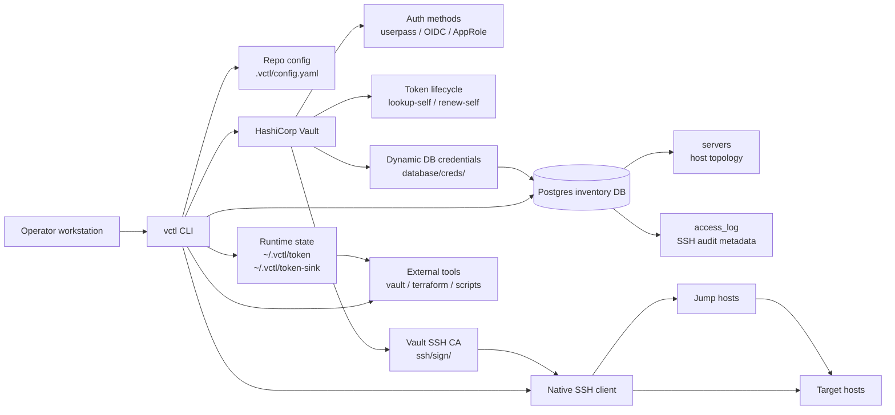
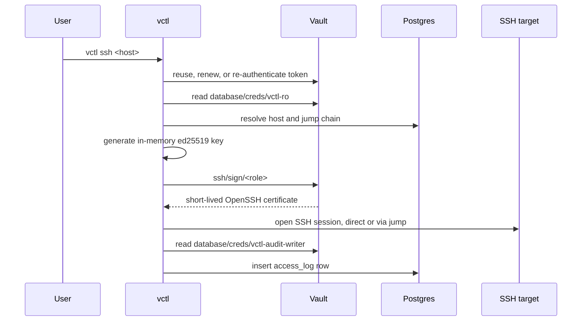

# vctl

[English README](README.md) · [日本語 README](README.ja.md)

`vctl`은 Vault를 기반으로 인프라 접근을 관리하는 CLI입니다. Vault 토큰을 직접 관리하고, Vault SSH CA로 짧은 수명의 SSH 인증서를 발급받으며, Postgres에서 호스트 인벤토리를 읽고 중앙 SSH 접근 감사 메타데이터를 기록합니다.

- 로컬 데몬 없음: 로그인, 갱신, 재인증, SSH 인증서 서명을 바이너리가 직접 처리합니다.
- 토큰 수명주기 관리: 만료 전에 갱신하고, 더 이상 갱신할 수 없으면 AppRole로 재인증합니다.
- 도구 연동: `vctl token`, `vctl exec`, `vctl agent` sink 파일로 다른 도구에 토큰을 제공합니다.
- 내장 private CA: 워크스테이션 추가 설정 없이 Vault와 Postgres TLS를 검증합니다.
- 정적 SSH 키 없음: 연결마다 메모리에서 키를 만들고 짧은 수명의 인증서를 요청합니다.
- 중앙 인벤토리: secret은 Vault에 두고, 호스트 토폴로지와 접근 감사 메타데이터만 Postgres에 저장합니다.
- 강화된 릴리스 경로: CI에서 테스트, Trivy 스캔, distroless 이미지 스캔, GoReleaser, Homebrew 업데이트, GHCR 배포를 수행합니다.

## Architecture



신뢰 경계는 단순합니다. 민감한 자격 증명은 Vault가 발급하고, Postgres에는 인벤토리와 감사 메타데이터만 저장합니다. `vctl`은 SSH 개인키를 메모리에만 보관합니다. 런타임 토큰은 제한적인 파일 권한으로 `~/.vctl/` 아래에 캐시됩니다.

## Runtime Flow



## Vault Agent 대체

```bash
# 기존 vault CLI에 토큰을 제공합니다.
export VAULT_TOKEN=$(vctl token)
vault kv get kv/services/foo

# 자식 프로세스에 VAULT_TOKEN과 VAULT_ADDR을 주입합니다.
vctl exec -- terraform apply
vctl exec -- vault kv get kv/services/foo

# 자식 프로세스는 시작 시점의 토큰 값을 환경 변수로 받습니다.
# 같은 토큰을 갱신하는 동안에는 계속 유효하지만, max_ttl 때문에 새 토큰이 필요해지면
# 자식 프로세스의 환경 변수에는 교체된 토큰을 전달할 수 없습니다.
# 오래 실행되는 작업에는 아래 sink 파일 방식을 사용하세요.

# 토큰 sink 파일을 계속 최신 상태로 유지합니다.
vctl agent --sink /run/user/$(id -u)/vault-token
VAULT_TOKEN=$(cat ~/.vctl/token-sink) vault kv get kv/services/foo
```

비대화형 환경에서는 AppRole 자격 증명을 제공합니다.

```bash
export VCTL_ROLE_ID_FILE=/etc/vctl/role_id
export VCTL_SECRET_ID_FILE=/etc/vctl/secret_id
vctl agent
```

## Vault Agent Mapping

| Vault Agent 개념 | vctl 명령 | 설명 |
|---|---|---|
| auto-auth | `login` 또는 AppRole env | CLI 로그인 1회 또는 비대화형 AppRole 인증 |
| token sink | `vctl agent --sink` | 다른 도구가 읽을 수 있는 토큰 파일을 씁니다 |
| auto-renew | 명령과 `agent`에 내장 | 만료 전에 토큰을 갱신합니다 |
| `agent exec` | `vctl exec --` | 자식 프로세스 실행 중 토큰을 유지합니다 |
| caching proxy | 미지원 | vctl은 토큰 공급과 SSH 접근에 집중합니다 |

## New User Flow

```bash
# 설치
brew install ghdwlsgur/vctl/vctl

# 로그인 (사람: GitLab SSO, 개인별 identity)
vctl login --method oidc

# 접속
vctl ssh sre-srv-0047
vctl ssh 0047
vctl ssh
vctl list

# 접근 이력 확인
vctl audit
vctl audit --detail
vctl audit --source-ip 192.0.2.10
```

컨테이너 이미지는 GitHub Container Registry에 배포됩니다.

```bash
docker pull ghcr.io/ghdwlsgur/vctl:latest
docker run --rm ghcr.io/ghdwlsgur/vctl:latest --version
```

`vctl`은 컴파일된 기본값으로 동작합니다. repo-local 설정은 `.vctl/config.yaml`에 두고, 런타임 토큰 캐시 파일은 `~/.vctl/` 아래에 저장합니다.

## Authentication

누가 로그인하는지에 따라 인증 방식을 선택합니다. identity는 반드시 개인별로 유지되어야 합니다. 감사 추적(`access_log`, SSH cert key-id, Vault audit)은 Vault가 인증한 주체를 기준으로 기록되므로, 여러 사람이 하나의 identity를 공유하면 안 됩니다.

| Method | Who | Notes |
|---|---|---|
| **`oidc` (GitLab SSO)** | **사람 (권장)** | 각 사용자가 `gitlab.sre.local`을 통해 본인 계정으로 로그인합니다. 개인 identity가 모든 감사 기록에 반영됩니다. 브라우저 세션 덕분에 재인증이 가볍습니다. |
| `approle` | 서비스 / 자동화 | 비대화형 인증(role_id + secret_id). 공유 approle은 하나의 identity입니다. 감사 collector 같은 데몬에는 괜찮지만 여러 사람이 함께 쓰면 안 됩니다. |
| `userpass` | fallback / bootstrap | 개인별 인증이지만 매번 수동으로 비밀번호를 입력해야 합니다. |

### GitLab SSO (OIDC)

```bash
# 일회성으로 지정하거나, .vctl/config.yaml에 auth_method: oidc를 설정해 기본값으로 사용합니다.
vctl login --method oidc        # 브라우저 열림 -> GitLab SSO -> 완료
vctl ssh sre-srv-0047
vctl audit -n 3                 # VAULT USER 컬럼에 GitLab username 표시
```

Vault의 `oidc` auth backend는 GitLab을 identity provider로 신뢰합니다. role은 GitLab의 `preferred_username` claim을 토큰에 매핑하므로, `vctl audit`과 Vault audit device에는 role 이름이 아니라 실제 사람이 기록됩니다. 토큰이 만료되면 비밀번호를 다시 입력하는 대신 짧은 SSO round-trip으로 재인증합니다.

> Vault/IaC 쪽 1회 작업(운영자 수행): GitLab application(Confidential, `openid profile email`, redirect URI `http://localhost:8250/oidc/callback` 및 Vault UI callback)이 client_id/secret을 제공하고, 이는 `kv/services/vault-oidc-gitlab`에 저장됩니다. OIDC backend와 role은 `vault-iac` repo에 있습니다(`enable_gitlab_oidc=true`).

## 접근 제어 (RBAC)

인가는 서버의 강제 경계와 CLI의 추가 제한으로 나뉩니다.

**계층 1 — Vault (강제 경계).** 모든 사용자는 인벤토리/RBAC 읽기와 자신의 로그인
기록만 가능한 `vctl-user`를 받습니다. GitLab 그룹이 실제 capability를 추가합니다.

- `vctl-ssh-users` -> `vctl-ssh`: SSH 인증서 서명과 append-only 접속 로그 쓰기
- `vctl-auditors` -> `vctl-auditor`: 접속·세션·커널 감사 데이터 읽기
- `vctl-admins`: 관리 + SSH + 감사 정책. 인벤토리/RBAC 쓰기, migration, CA 작업 가능

Vault policy와 Identity 관리는 자기 권한 상승을 막기 위해 Terraform/플랫폼 관리자만
수행합니다.

**계층 2 — 앱 (추가 제한).** `vctl rbac`은 Postgres에 커맨드 grant를 저장하고 기본
CLI가 실행 전에 검사합니다.

- 읽기 커맨드는 앱에서 기본 허용하지만, `audit`과 `session`은 Vault의
  `vctl-auditor` 정책이 없으면 DB 자격 증명 발급 단계에서 거부됩니다.
- 변경·접속 커맨드(`ssh`, `exec`, `sync`, `prune`, `trust-ca`)는 그룹이 권한을
  부여하기 전까지 거부됩니다.
- `vctl-admin`(과 `sre-admin`)은 앱 계층을 우회하므로 관리자가 스스로 막히는 일은
  없습니다.

관리자는 CLI에서 인터랙티브 픽커로 다룹니다.

```bash
vctl rbac group create devs        # 그룹 생성
vctl rbac assign [devs]            # 그룹 선택 -> 추가할 유저 멀티선택
vctl rbac grant  [devs]            # 그룹 선택 -> 커맨드 멀티선택 (ssh, sync, … 또는 *)
vctl rbac whoami                   # 내 신원·admin 여부·그룹·부여된 커맨드
vctl rbac users                    # 로그인한 사람들과 각자의 vctl 버전
```

`assign`의 후보 유저는 로그인한 모든 사람(`vctl login`이 신원을 기록) + 기존
멤버에서 나오므로, 새 팀원은 한 번 로그인하면 후보에 나타납니다. `vctl ssh`는
Vault의 `vctl-ssh` 정책도 가져야 합니다. 따라서 CLI를 수정하거나 Vault API를 직접
호출해도 서버의 SSH 인가를 우회할 수 없습니다.

## SSH Flow

```text
vctl ssh <host>
  -> Vault 토큰 재사용 또는 갱신/재인증
  -> 짧은 수명의 Postgres 자격 증명을 database/creds/vctl-ro에서 읽음
  -> 인벤토리에서 호스트(hostname 또는 IP — primary/extra/observed)와 jump chain 해석
  -> 메모리에서 ed25519 키 생성
  -> ssh/sign/<role>로 짧은 수명의 인증서 요청
  -> direct 또는 jump-chain 경로로 native SSH 세션 열기
  -> source/client/target 메타데이터를 포함한 access_log row를 best-effort로 기록
```

처음 보는 SSH host key는 인터랙티브 모드에서 fingerprint 확인을 요구합니다.
비대화형 `--server`는 미등록 key를 거부하므로 자동화 전에 신뢰 가능한 경로로
`~/.ssh/known_hosts`를 준비해야 합니다. MCP 서버(`vctl mcp`)는 처음 보는 key를
첫 접속 시 기록(accept-new)해 에이전트가 갓 온보딩한 호스트에도 접근할 수 있게
합니다. 단 *불일치*하는 기존 key는 항상 거부합니다.

여러 주소(primary NIC + 플로팅 VIP나 추가 NIC)를 가진 호스트는 그중 무엇으로도
접속됩니다. `vctl ssh --server <ip>`는 primary `ip`, 운영자가 지정한 `extra_ips`
(`dbedit -col ips`), node-agent의 `observed_ips` 중 하나와 매칭하며, `vctl list`가
추가 IP를 함께 표시합니다. 인터랙티브 픽커는 ←/→로 데이터센터별 필터링도 됩니다.

## Access Audit

`vctl ssh`는 각 연결 시도 후 inventory 수준의 감사 row를 best-effort로 기록합니다. row에는 다음 정보가 포함됩니다.

- `lookup-self`에서 확인한 Vault identity
- 대상 hostname과 target address
- SSH socket에서 관찰한 source IP와 source address
- 로컬 client hostname과 OS user
- 사용한 jump host
- Vault가 발급한 SSH 인증서 serial
- 연결 결과와 길이가 제한된 error text

기본 출력은 간결합니다.

```bash
vctl audit
```

상세 출력에는 client host, source address, cert serial, error가 포함됩니다.

```bash
vctl audit --detail
```

host, Vault user, 정확한 source IP로 필터링할 수 있습니다.

```bash
vctl audit --host sre-srv-0047
vctl audit --user albert
vctl audit --source-ip 192.0.2.10
```

이 감사 테이블은 운영 메타데이터입니다. 인증서 서명 요청의 authoritative record는 여전히 Vault audit device입니다.

## MCP (AI 에이전트)

`vctl mcp`는 stdio 기반 Model Context Protocol 서버(JSON-RPC 2.0, 추가 의존성 없음)를
실행해 Claude Code 같은 AI 에이전트가 인벤토리를 도구로 쓰게 합니다. 한 번만 연결하면 됩니다.

```bash
claude mcp add vctl -- vctl mcp
```

| 도구 | 용도 |
|---|---|
| `vctl_list` | 인벤토리(hostname, primary + extra IP, DC, user, jump, liveness), DC 필터 옵션 |
| `vctl_resolve` | hostname(fuzzy) 또는 IP(primary/extra/observed)를 레코드로 해석 |
| `vctl_whoami` | 현재 신원, 정책, 관리자 여부, 허용된 RBAC 커맨드 |
| `vctl_access_log` | 최근 SSH 접속 기록(감사 읽기 권한 필요) |
| `vctl_ssh_exec` | 호스트에서 명령을 SSH로 실행하고 stdout/stderr/exit 반환 |

도구는 현재 vctl 신원으로 동작하므로 Vault 정책과 앱 계층 RBAC가 그대로 적용됩니다.
`vctl_ssh_exec`는 `vctl ssh`와 동일하게 게이트되며(Vault `vctl-ssh` 정책 + 앱 RBAC `ssh`)
같은 jump chain으로 Vault 서명 인증서를 써서 접속합니다. 인증은 AppRole로 고정돼, 세션이
만료되면 비대화형으로 재인증하거나 에러를 낼 뿐 stdio 채널을 깨뜨릴 로그인 프롬프트를 띄우지
않습니다. 읽기 전용 AppRole은 SSH 인증서를 서명할 수 없으므로 `vctl_ssh_exec`에는 ssh
가능한 활성 세션(`vctl login`)이 필요하고, 읽기 도구는 어느 쪽이든 동작합니다.

## Commands

| Command | Description |
|---|---|
| `vctl login [--method userpass\|oidc\|approle]` | Vault에 로그인하고 토큰을 캐시합니다 |
| `vctl token` | 갱신 또는 재인증 후 유효한 Vault 토큰을 출력합니다 |
| `vctl exec -- <cmd>` | 자식 프로세스를 `VAULT_TOKEN`, `VAULT_ADDR`와 함께 실행합니다 |
| `vctl agent [--sink <path>]` | 토큰을 유지하고 sink 파일에 기록합니다 |
| `vctl ssh [host] [--server <host>]` | exact, fuzzy, IP, interactive 선택으로 접속합니다(픽커는 ←/→로 DC 필터). `--server`는 정확히 또는 IP로 해석해 비대화형으로 접속합니다(스크립트/에이전트용) |
| `vctl list [--dc <dc>]` | 인벤토리 호스트를 나열합니다(primary + extra IP, liveness/agent 상태) |
| `vctl mcp` | 인벤토리를 AI 에이전트에 노출하는 읽기 전용 MCP 서버(stdio). `vctl_ssh_exec`로 호스트 명령 실행도 가능. 호출자 신원으로 동작 — RBAC 적용 |
| `vctl rbac <group\|member\|grant\|revoke\|assign\|users\|whoami\|check>` | 앱 계층 커맨드 RBAC 관리(관리자). `assign`/`grant`은 인터랙티브 픽커 |
| `vctl audit [--detail] [--host <host>] [--user <user>] [--source-ip <ip>]` | 중앙 SSH 접근 감사 row를 보여줍니다 |
| `vctl node-agent [--interval 5m]` | 이미 등록된 인벤토리 호스트의 가벼운 런타임 상태를 보고합니다 |
| `vctl status` | 로그인, SSH CA, inventory DB 연결 상태를 확인합니다 |
| `vctl sync [--migrate] [--prefix sre]` | `~/.ssh/config`와 probe 결과에서 인벤토리를 동기화합니다 |
| `vctl logout` | 캐시된 Vault 토큰을 제거합니다 |

## Configuration

`VAULT_ADDR`, `VCTL_AUTH_METHOD`, `VCTL_ROLE_ID_FILE`, `VCTL_SECRET_ID_FILE`, `VCTL_SINK`, `VCTL_DB_HOST`, `VCTL_CA_ROLE`, `VCTL_SSH_DEFAULT_USER`, `VCTL_SSH_DIRECT_FIRST`, `VCTL_SYNC_PROBE_TIMEOUT`, `VCTL_SYNC_PROBE_CONCURRENCY` 같은 환경 변수는 컴파일된 기본값을 override합니다.

config 파일은 **선택 사항**입니다. `vctl`은 컴파일된 기본값으로 실행되며, 로그인할 때 이 파일을 만들지 않습니다. 값을 바꿔야 할 때만 샘플을 복사하세요. 예를 들어 `auth_method: oidc`를 기본값으로 바꿀 수 있습니다. 파일에는 변경하는 key만 남기는 편이 좋습니다. secret은 넣지 않습니다. Vault가 런타임에 토큰과 DB 자격 증명을 발급합니다.

```bash
mkdir -p .vctl
cp .vctl/config.example.yaml .vctl/config.yaml   # 그 다음 override할 값만 남기세요
```

모든 key와 컴파일된 기본값은 다음과 같습니다.

```yaml
vault_addr: https://vault.sre.local
auth_method: oidc # 사람: GitLab SSO(개인별). userpass/approle도 지원.
oidc_role: vctl
oidc_mount: oidc

db_host: vctl-postgres.sre.local
db_port: 5432
db_name: vctl
db_role_ro: vctl-ro
db_role_rw: vctl-rw
db_role_identity: vctl-identity
db_role_audit_ro: vctl-audit-ro
db_role_audit_write: vctl-audit-writer
db_role_audit_ingest: vctl-audit-ingest
db_role_prune: vctl-pruner
db_role_status: vctl-status
db_role_migrate: vctl-migrator
db_migration_owner: vctl_owner

ca_role: sre-core
ssh_sign: 30m
ssh_direct_first: true
ssh_default_user: ubuntu

sync_probe_timeout: 3s
sync_probe_concurrency: 32
dc_rules:
  - name: incheon
    prefixes: ["10.40.0.", "192.168.10."]
  - name: seoul-onprem
    prefixes: ["192.168.201.", "192.168.190.", "192.168.110."]
```

jump-only 환경에서는 `.vctl/config.yaml`에 `ssh_direct_first: false`를 설정하세요. 그러면 direct SSH 연결 timeout을 기다리지 않고 설정된 jump chain을 바로 사용합니다.

`vctl node-agent`는 선택 사항입니다. 이미 `servers`에 등록된 host의 관측
상태만 `server_status`에 보고하며, 인벤토리 row를 새로 만들지 않습니다.
서버에 설치할 때는 `deploy/vault/`의 별도 `vctl-node` Vault policy와
`vctl-status` DB role을 사용하세요. 저리소스 systemd unit은 `deploy/node/`에
있습니다.

## Admin Bootstrap

```bash
# Vault DB engine, role, policy를 설정합니다.
PG_ADMIN_PASS=<root-password> ./deploy/vault/setup.sh

# 팀원용 userpass 계정을 만듭니다.
vault write auth/userpass/users/<id> password=<once> policies=vctl-user
# 필요한 사람에게만 vctl-ssh 또는 vctl-auditor를 추가합니다.

# vctl-admin token으로 초기 인벤토리를 적재합니다.
vctl sync --migrate
```

OIDC 설정은 [deploy/vault/oidc-phase2.md](deploy/vault/oidc-phase2.md)에 문서화되어 있습니다.

## Build And Verify

```bash
make build
make test
make vet
make trivy
```

`make trivy`는 Go dependency, repository secret, Dockerfile misconfiguration을 스캔합니다. CI는 릴리스 배포 전에 distroless 이미지도 스캔합니다.

## Release

Git tag를 push하면 릴리스가 배포됩니다. GoReleaser는 GitHub Release artifact를 만들고, `ghdwlsgur/homebrew-vctl` repository의 `Formula/vctl.rb`를 업데이트하며, distroless 이미지를 `ghcr.io/ghdwlsgur/vctl`에 배포합니다.

필수 repository secret:

```text
HOMEBREW_TAP_GITHUB_TOKEN
```

이 토큰은 `ghdwlsgur/homebrew-vctl`에 push할 수 있어야 합니다.

```bash
git tag -a v0.1.7 -m "Release v0.1.7"
git push origin v0.1.7
```

릴리스 workflow는 pinned GitHub Actions를 사용하고, 테스트와 Trivy를 실행하며, distroless 이미지를 스캔하고, GitHub Release artifact를 배포하고, Homebrew와 GHCR tag를 업데이트합니다.

## Security Notes

- 인벤토리는 토폴로지만 포함합니다. 인증서, Vault 토큰, DB 자격 증명은 짧은 수명으로 Vault가 발급합니다.
- 런타임 토큰 파일은 `~/.vctl/` 또는 설정된 sink 경로에 제한적인 권한으로 기록됩니다. regular file이 아닌 sink target은 거부합니다.
- OIDC callback 처리는 loopback에 bind하고, callback state를 검증하며, HTTP header timeout을 사용합니다.
- SSH 개인키는 연결마다 메모리에서 생성되며 디스크에 쓰지 않습니다.
- Postgres 연결은 Vault가 발급한 짧은 수명의 자격 증명을 사용하고, 내장 CA로 verify-full TLS를 수행합니다.
- GitHub Actions는 commit SHA에 pin되어 있고, release automation은 GoReleaser major version을 pin합니다.

## Design Notes

- Vault는 auth, token renewal, SSH certificate signing, dynamic DB credentials, signing audit log의 source of truth입니다.
- Postgres는 중앙 인벤토리와 운영 접근 감사 메타데이터를 저장합니다.
- SSH CA key rotation과 DB credential rotation은 독립적입니다.
- 컴파일된 기본값은 onboarding 기본값일 뿐입니다. Vault, DB, CA role, SSH user, direct-first behavior, sync probing, DC classification은 env var 또는 `.vctl/config.yaml`로 override합니다.

## Layout

```text
cmd/vctl              entrypoint
cmd/dbedit            maintenance tool for operator-managed inventory (-col dc|user|name|ips|del)
internal/config       generic loader (config.go) + org-specific defaults (defaults_sre.go) + embedded CA
internal/vaultc       Vault auth, token lifecycle, SSH signing, DB credentials, CA reads
internal/store        Postgres inventory, app-layer RBAC, access/session/kernel audit, host status (verify-full TLS)
internal/sshc         native SSH client with cert signer, jump chains, PTY, and connection metadata
internal/syncx        ssh config parsing and host probing
internal/hoststatus   node-agent host metrics collection (/proc, syscall) with pure, testable parsers
internal/strutil      tiny shared string helpers
internal/cli          Cobra commands (incl. app-layer RBAC: vctl rbac, MCP server: vctl mcp)
deploy/vault          policies (incl. RBAC vctl-admin/user + vctl-admins group), DB engine bootstrap, OIDC guide
```
