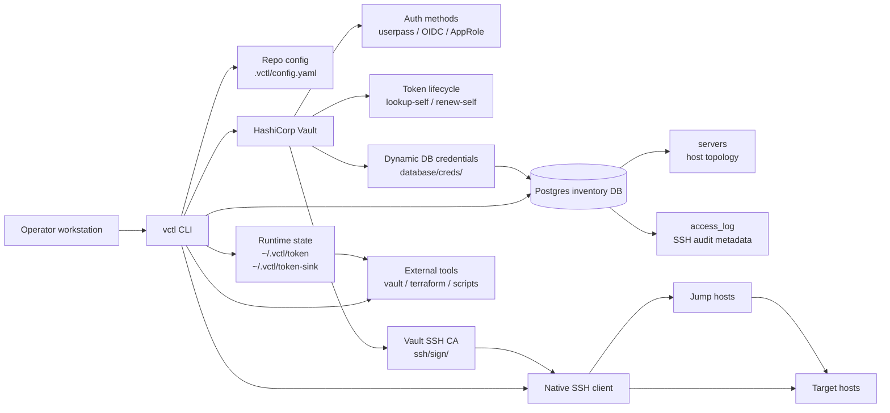
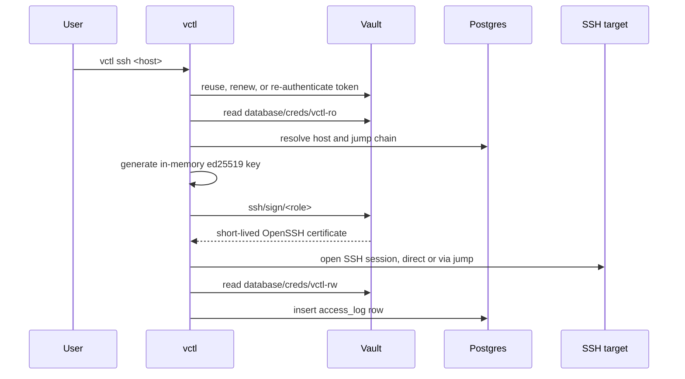

# vctl

`vctl` is a Vault-backed infrastructure access CLI. It manages Vault tokens directly, signs short-lived SSH certificates through Vault SSH CA, reads host inventory from Postgres, and records central SSH access audit metadata.

- No local daemon: the binary handles login, renewal, re-authentication, and SSH certificate signing.
- Token lifecycle management: renew before expiry and re-authenticate with AppRole when renewal is no longer possible.
- Tool integration: expose tokens through `vctl token`, `vctl exec`, and `vctl agent` sink files.
- Embedded private CA: validate Vault and Postgres TLS without extra workstation setup.
- No static SSH keys: generate an in-memory key per connection and request a short-lived certificate.
- Central inventory: store host topology and access audit metadata in Postgres while keeping secrets in Vault.
- Hardened release path: CI runs tests, Trivy scans, distroless image scans, GoReleaser, Homebrew updates, and GHCR publishing.

## Architecture



The trust boundary is simple: Vault issues all sensitive credentials, Postgres stores only inventory and audit metadata, and `vctl` keeps private SSH keys in memory only. Runtime tokens are cached under `~/.vctl/` with restrictive file permissions.

## Runtime Flow



## Vault Agent Replacement

```bash
# Provide a token to the existing vault CLI.
export VAULT_TOKEN=$(vctl token)
vault kv get kv/services/foo

# Inject VAULT_TOKEN and VAULT_ADDR into a child process.
vctl exec -- terraform apply
vctl exec -- vault kv get kv/services/foo

# The child process receives the token value from startup time.
# Renewing the same token keeps it valid, but if max_ttl forces a new token,
# the child process cannot receive the replacement through its environment.
# For very long-running jobs, use the sink file mode below.

# Keep a token sink file updated.
vctl agent --sink /run/user/$(id -u)/vault-token
VAULT_TOKEN=$(cat ~/.vctl/token-sink) vault kv get kv/services/foo
```

For non-interactive environments, provide AppRole credentials:

```bash
export VCTL_ROLE_ID_FILE=/etc/vctl/role_id
export VCTL_SECRET_ID_FILE=/etc/vctl/secret_id
vctl agent
```

## Vault Agent Mapping

| Vault Agent concept | vctl command | Notes |
|---|---|---|
| auto-auth | `login` or AppRole env | One CLI login or non-interactive AppRole auth |
| token sink | `vctl agent --sink` | Writes a token file for other tools |
| auto-renew | built into commands and `agent` | Renews before expiry |
| `agent exec` | `vctl exec --` | Keeps the token alive while the child process runs |
| caching proxy | not supported | vctl focuses on token supply and SSH access |

## New User Flow

```bash
# Install
brew install ghdwlsgur/vctl/vctl

# Login
vctl login

# Connect
vctl ssh sre-srv-0047
vctl ssh 0047
vctl ssh
vctl list

# Review access history
vctl audit
vctl audit --detail
vctl audit --source-ip 192.0.2.10
```

Container images are published to GitHub Container Registry:

```bash
docker pull ghcr.io/ghdwlsgur/vctl:latest
docker run --rm ghcr.io/ghdwlsgur/vctl:latest --version
```

`vctl` works with compiled defaults. Repo-local configuration lives in `.vctl/config.yaml`, and runtime token cache files live under `~/.vctl/`.

## SSH Flow

```text
vctl ssh <host>
  -> reuse or refresh a Vault token
  -> read database/creds/vctl-ro for short-lived Postgres credentials
  -> resolve the host and jump chain from Postgres inventory
  -> generate an in-memory ed25519 key
  -> request a short-lived certificate from ssh/sign/<role>
  -> open a native SSH session with direct or jump-chain routing
  -> write a best-effort access_log row with source/client/target metadata
```

## Access Audit

`vctl ssh` writes a best-effort inventory-level audit row after each connection attempt. The row includes:

- Vault identity from `lookup-self`
- target hostname and target address
- source IP and source address observed from the SSH socket
- local client hostname and OS user
- jump host, when used
- Vault-issued SSH certificate serial
- connection result and bounded error text

Default output is compact:

```bash
vctl audit
```

Detailed output includes client host, source address, cert serial, and error:

```bash
vctl audit --detail
```

Filtering is available for host, Vault user, and exact source IP:

```bash
vctl audit --host sre-srv-0047
vctl audit --user albert
vctl audit --source-ip 192.0.2.10
```

This audit table is operational metadata. The Vault audit device remains the authoritative record for certificate signing requests.

## Commands

| Command | Description |
|---|---|
| `vctl login [--method userpass\|oidc\|approle]` | Log in to Vault and cache the token |
| `vctl token` | Print a valid Vault token after renewal or re-authentication |
| `vctl exec -- <cmd>` | Run a child process with `VAULT_TOKEN` and `VAULT_ADDR` |
| `vctl agent [--sink <path>]` | Keep a token alive and write it to sink files |
| `vctl ssh [host]` | Connect by exact, fuzzy, or interactive host selection |
| `vctl list [--dc <dc>]` | List inventory hosts |
| `vctl audit [--detail] [--host <host>] [--user <user>] [--source-ip <ip>]` | Show central SSH access audit rows |
| `vctl status` | Check login, SSH CA, and inventory DB connectivity |
| `vctl sync [--migrate] [--prefix sre]` | Sync inventory from `~/.ssh/config` and probes |
| `vctl logout` | Remove the cached Vault token |

## Configuration

Environment variables such as `VAULT_ADDR`, `VCTL_AUTH_METHOD`, `VCTL_ROLE_ID_FILE`, `VCTL_SECRET_ID_FILE`, `VCTL_SINK`, `VCTL_DB_HOST`, `VCTL_CA_ROLE`, `VCTL_SSH_DEFAULT_USER`, `VCTL_SSH_DIRECT_FIRST`, `VCTL_SYNC_PROBE_TIMEOUT`, and `VCTL_SYNC_PROBE_CONCURRENCY` override the compiled defaults.

Start from the sample config:

```bash
mkdir -p .vctl
cp .vctl/config.example.yaml .vctl/config.yaml
```

Example:

```yaml
vault_addr: https://vault.sre.local
auth_method: userpass
oidc_role: vctl
oidc_mount: oidc

db_host: vctl-postgres.sre.local
db_port: 5432
db_name: vctl
db_role_ro: vctl-ro
db_role_rw: vctl-rw
db_role_migrate: vctl-migrator
db_migration_owner: vctl_owner

ca_role: sre-core
ssh_sign: 30m
ssh_direct_first: true
ssh_default_user: ubuntu

sync_probe_timeout: 3s
sync_probe_concurrency: 32
dc_rules:
  - name: incheon
    prefixes: ["10.40.0.", "192.168.10."]
  - name: seoul-onprem
    prefixes: ["192.168.201.", "192.168.190.", "192.168.110."]
```

Set `ssh_direct_first: false` in jump-only environments to skip direct SSH connection attempts and avoid waiting for direct-connect timeouts before using the configured jump chain.

## Admin Bootstrap

```bash
# Configure the Vault DB engine, roles, and policies.
PG_ADMIN_PASS=<root-password> ./deploy/vault/setup.sh

# Create a userpass account for a teammate.
vault write auth/userpass/users/<id> password=<once> policies=vctl-user

# Initial inventory load with a vctl-admin token.
vctl sync --migrate
```

OIDC setup is documented in [deploy/vault/oidc-phase2.md](deploy/vault/oidc-phase2.md).

## Build And Verify

```bash
make build
make test
make vet
make trivy
```

`make trivy` scans Go dependencies, repository secrets, and Dockerfile misconfigurations. CI also scans the distroless image before release publishing.

## Release

Releases are published by pushing a Git tag. GoReleaser creates GitHub Release artifacts, updates `Formula/vctl.rb` in the `ghdwlsgur/homebrew-vctl` repository, and publishes a distroless image to `ghcr.io/ghdwlsgur/vctl`.

Required repository secret:

```text
HOMEBREW_TAP_GITHUB_TOKEN
```

The token must be allowed to push to `ghdwlsgur/homebrew-vctl`.

```bash
git tag -a v0.1.7 -m "Release v0.1.7"
git push origin v0.1.7
```

The release workflow uses pinned GitHub Actions, runs tests and Trivy, scans the distroless image, publishes GitHub Release artifacts, updates Homebrew, and pushes GHCR tags.

## Security Notes

- Inventory contains topology only. Certificates, Vault tokens, and DB credentials are short-lived and issued by Vault.
- Runtime token files are written under `~/.vctl/` or configured sink paths with restrictive permissions. Non-regular sink targets are rejected.
- OIDC callback handling binds to loopback, validates callback state, and uses HTTP header timeouts.
- SSH private keys are generated in memory for each connection and are not written to disk.
- Postgres connections use short-lived Vault-issued credentials and verify-full TLS with the embedded CA.
- GitHub Actions are pinned to commit SHAs and release automation uses a pinned GoReleaser major version.

## Design Notes

- Vault is the source of truth for auth, token renewal, SSH certificate signing, dynamic DB credentials, and signing audit logs.
- Postgres stores central inventory and operational access audit metadata.
- SSH CA key rotation and DB credential rotation are independent.
- Compiled defaults are onboarding defaults only. Override Vault, DB, CA role, SSH user, direct-first behavior, sync probing, and DC classification through env vars or `.vctl/config.yaml`.

## Layout

```text
cmd/vctl              entrypoint
internal/config       defaults and embedded CA
internal/vaultc       Vault auth, token lifecycle, SSH signing, DB credentials, CA reads
internal/store        Postgres inventory and access audit with verify-full TLS
internal/sshc         native SSH client with cert signer, jump chains, PTY, and connection metadata
internal/syncx        ssh config parsing and host probing
internal/cli          Cobra commands
deploy/vault          policies, DB engine bootstrap, and OIDC guide
```
