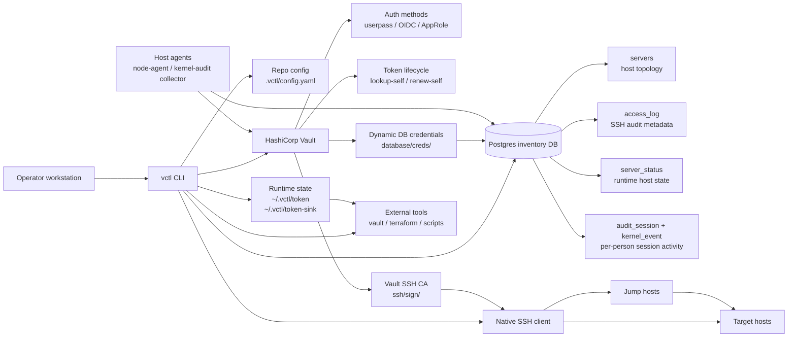
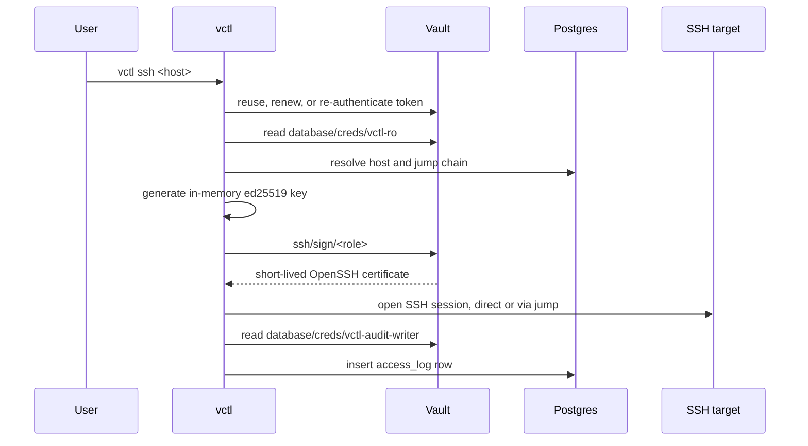

# vctl

[한국어 README](README.ko.md) · [日本語 README](README.ja.md)

`vctl` is a Vault-backed infrastructure access CLI. It manages Vault tokens directly, signs short-lived SSH certificates through Vault SSH CA, reads host inventory from Postgres, and records central SSH access audit metadata.

- No local daemon: the binary handles login, renewal, re-authentication, and SSH certificate signing.
- Token lifecycle management: renew before expiry and re-authenticate with AppRole when renewal is no longer possible.
- Tool integration: expose tokens through `vctl token`, `vctl exec`, and `vctl agent` sink files.
- Embedded private CA: validate Vault and Postgres TLS without extra workstation setup.
- No static SSH keys: generate an in-memory key per connection and request a short-lived certificate.
- Central inventory: store host topology and access audit metadata in Postgres while keeping secrets in Vault.
- Host agents (optional): low-resource daemons report per-person kernel session activity and runtime host status into Postgres, attributed to whoever logged in — the agent-less Vault pattern applied server-side.
- Hardened release path: CI runs tests, Trivy scans, distroless image scans, GoReleaser, Homebrew updates, and GHCR publishing.

## How to install

### macOS

Install with Homebrew on Apple Silicon or Intel Macs:

```bash
brew install ghdwlsgur/vctl/vctl
```

### Windows

Install from the Chocolatey Community Repository in an Administrator PowerShell:

```powershell
choco install vctl
vctl --version
```

New Chocolatey packages may remain unavailable until their first community
moderation is approved. Windows `amd64` and `arm64` ZIP archives are also
available on the [GitHub Releases](https://github.com/ghdwlsgur/vctl/releases/latest) page.

### Linux

Download the latest package for your architecture with the GitHub CLI. Replace
`amd64` with `arm64` where needed.

Debian and Ubuntu:

```bash
gh release download --repo ghdwlsgur/vctl --pattern 'vctl_*_linux_amd64.deb'
sudo apt install ./vctl_*_linux_amd64.deb
```

RHEL, Rocky Linux, AlmaLinux, and Fedora:

```bash
gh release download --repo ghdwlsgur/vctl --pattern 'vctl_*_linux_amd64.rpm'
sudo dnf install ./vctl_*_linux_amd64.rpm
```

For other distributions, download the `linux_amd64.tar.gz` or
`linux_arm64.tar.gz` archive from
[GitHub Releases](https://github.com/ghdwlsgur/vctl/releases/latest), extract
`vctl`, and place it in a directory on `PATH` such as `/usr/local/bin`.

## Architecture


```mermaid
flowchart LR
  user[Operator workstation] --> cli[vctl CLI]

  cli --> cfg[Repo config\n.vctl/config.yaml]
  cli --> cache[Runtime state\n~/.vctl/token\n~/.vctl/token-sink]

  cli --> vault[HashiCorp Vault]
  vault --> auth[Auth methods\nuserpass / OIDC / AppRole]
  vault --> token[Token lifecycle\nlookup-self / renew-self]
  vault --> sshca[Vault SSH CA\nssh/sign/<role>]
  vault --> dbcreds[Dynamic DB credentials\ndatabase/creds/<role>]

  cli --> pg[(Postgres inventory DB)]
  dbcreds --> pg
  pg --> inv[servers\nhost topology]
  pg --> audit[access_log\nSSH audit metadata]
  pg --> status[server_status\nruntime host state]
  pg --> sess[audit_session + kernel_event\nper-person session activity]

  agents[Host agents\nnode-agent / kernel-audit collector] --> vault
  agents --> pg

  cli --> ssh[Native SSH client]
  sshca --> ssh
  ssh --> target[Target hosts]
  ssh --> jump[Jump hosts]
  jump --> target

  cli --> tools[External tools\nvault / terraform / scripts]
  cache --> tools
```

The trust boundary is simple: Vault issues all sensitive credentials, Postgres stores only inventory and audit metadata, and `vctl` keeps private SSH keys in memory only. Runtime tokens are cached under `~/.vctl/` with restrictive file permissions.

## Runtime Flow


```mermaid
sequenceDiagram
  participant User
  participant VCTL as vctl
  participant Vault
  participant PG as Postgres
  participant SSH as SSH target

  User->>VCTL: vctl ssh <host>
  VCTL->>Vault: reuse, renew, or re-authenticate token
  VCTL->>Vault: read database/creds/vctl-ro
  VCTL->>PG: resolve host and jump chain
  VCTL->>VCTL: generate in-memory ed25519 key
  VCTL->>Vault: ssh/sign/<role>
  Vault-->>VCTL: short-lived OpenSSH certificate
  VCTL->>SSH: open SSH session, direct or via jump
  VCTL->>Vault: read database/creds/vctl-audit-writer
  VCTL->>PG: insert access_log row
```

## Vault Agent Replacement

```bash
# Provide a token to the existing vault CLI.
export VAULT_TOKEN=$(vctl token)
vault kv get kv/services/foo

# Inject VAULT_TOKEN and VAULT_ADDR into a child process.
vctl exec -- terraform apply
vctl exec -- vault kv get kv/services/foo

# The child process receives the token value from startup time.
# Renewing the same token keeps it valid, but if max_ttl forces a new token,
# the child process cannot receive the replacement through its environment.
# For very long-running jobs, use the sink file mode below.

# Keep a token sink file updated.
vctl agent --sink /run/user/$(id -u)/vault-token
VAULT_TOKEN=$(cat ~/.vctl/token-sink) vault kv get kv/services/foo
```

For non-interactive environments, provide AppRole credentials:

```bash
export VCTL_ROLE_ID_FILE=/etc/vctl/role_id
export VCTL_SECRET_ID_FILE=/etc/vctl/secret_id
vctl agent
```

## Vault Agent Mapping

| Vault Agent concept | vctl command | Notes |
|---|---|---|
| auto-auth | `login` or AppRole env | One CLI login or non-interactive AppRole auth |
| token sink | `vctl agent --sink` | Writes a token file for other tools |
| auto-renew | built into commands and `agent` | Renews before expiry |
| `agent exec` | `vctl exec --` | Keeps the token alive while the child process runs |
| caching proxy | not supported | vctl focuses on token supply and SSH access |

## New User Flow

```bash
# Login — GitLab SSO by default (per-person identity), zero config needed
vctl login

# Connect
vctl ssh sre-srv-0047
vctl ssh 0047
vctl ssh
vctl list

# Review access history
vctl audit
vctl audit --detail
vctl audit --source-ip 192.0.2.10
```

Container images are published to GitHub Container Registry:

```bash
docker pull ghcr.io/ghdwlsgur/vctl:latest
docker run --rm ghcr.io/ghdwlsgur/vctl:latest --version
```

`vctl` works with compiled defaults. Repo-local configuration lives in `.vctl/config.yaml`, and runtime token cache files live under `~/.vctl/`.

## Authentication

Pick the method by who is logging in. Identity must stay per-person — the audit
trail (access_log, SSH cert key-id, Vault audit) attributes to whoever Vault
authenticated, so people should never share one identity.

| Method | Who | Notes |
|---|---|---|
| **`oidc` (GitLab SSO)** | **People (default)** | Each user logs in as themselves through the organization's GitLab. Per-person identity flows to every audit record. Browser session makes re-auth light. `vctl login` uses this with no flag or config. |
| `approle` | Services / automation | Non-interactive (role_id + secret_id). A shared approle is one identity — fine for a daemon (e.g. the audit collector), **not** for multiple people. |
| `userpass` | Fallback / bootstrap | Per-person, but a manual password each time. |

### GitLab SSO (OIDC)

```bash
vctl login                      # OIDC is the default -> opens a browser -> GitLab SSO
vctl ssh sre-srv-0047
vctl audit -n 3                 # VAULT USER column shows your GitLab username
```

(`vctl login --method userpass` for bootstrap, or set `auth_method: userpass` to override.)

Vault's `oidc` auth backend trusts GitLab as the identity provider; the role
maps the GitLab `preferred_username` claim into the token so `vctl audit` and
the Vault audit device record the actual person (not a role name). Token expiry
is re-satisfied by a quick SSO round-trip rather than re-typing a password.

> Vault/IaC side (one-time, by an operator): a GitLab application (Confidential,
> `openid profile email`, redirect URIs `http://localhost:8250/oidc/callback` and
> the Vault UI callback) provides the client_id/secret, stored in
> `kv/services/vault-oidc-gitlab`; the OIDC backend + role live in the `vault-iac`
> repo (`enable_gitlab_oidc=true`).

## Access Control (RBAC)

Authorization has a hard server boundary plus a narrower CLI policy.

**Layer 1 — Vault (authoritative).** Every authenticated user gets `vctl-user`,
which can read inventory/RBAC data and update its login record but cannot sign SSH
certificates or read audit payloads. GitLab groups add capabilities:

- `vctl-ssh-users` -> `vctl-ssh`: SSH signing and append-only access logging.
- `vctl-auditors` -> `vctl-auditor`: read-only access/session/kernel audit data.
- `vctl-admins` -> admin + SSH + auditor policies: inventory/RBAC writes, migration,
  CA operations, SSH, and audit reads. Vault policy/Identity administration stays
  with Terraform/platform administrators to prevent self-escalation.

**Layer 2 — app (additional restriction).** `vctl rbac` stores command grants in
Postgres and is enforced by the stock CLI before each command:

- Read commands are allowed by the app by default, but Vault still denies audit
  commands unless the token carries `vctl-auditor`.
- Mutate/connect commands (`ssh`, `exec`, `sync`, `trust-ca`) are denied
  until a group grants them.
- `vctl-admin` (and `sre-admin`) bypass the app layer, so admins never lock out.

Admins manage it from the CLI, with interactive pickers:

```bash
vctl rbac group create devs        # create a group
vctl rbac assign [devs]            # pick a group -> multi-select users to add
vctl rbac grant  [devs]            # pick a group -> multi-select commands (ssh, sync, … or *)
vctl rbac whoami                   # your identity, admin status, groups, granted commands
vctl rbac users                    # everyone who has logged in, with their vctl version
```

Candidate users for `assign` come from everyone who has logged in (`vctl login`
records the identity) plus existing members, so a new teammate appears after one
login. A PostgreSQL SSH command grant cannot create signing authority: the token
must independently carry `vctl-ssh`, so direct Vault API calls cannot bypass it.

## SSH Flow

```text
vctl ssh <host>
  -> reuse or refresh a Vault token
  -> read database/creds/vctl-ro for short-lived Postgres credentials
  -> resolve the host (by hostname, or by IP — primary, extra, or observed) and jump chain from Postgres inventory
  -> generate an in-memory ed25519 key
  -> request a short-lived certificate from ssh/sign/<role>
  -> open a native SSH session with direct or jump-chain routing
  -> write a best-effort access_log row with source/client/target metadata
```

An unknown SSH host key requires explicit confirmation in interactive mode.
`--server` is non-interactive and rejects unknown keys; pre-populate
`~/.ssh/known_hosts` through a trusted channel before using it in automation.
The MCP server (`vctl mcp`) records an unknown key on first use (accept-new) so
an agent can reach freshly onboarded hosts; a *mismatched* known key is always
rejected.

A host answering on several addresses (a primary NIC plus floating VIPs or extra
NICs) is reachable by any of them: `vctl ssh --server <ip>` matches the primary
`ip`, an operator-set `extra_ips` (via `dbedit -col ips`), or a node-agent
`observed_ips`, and `vctl list` shows the extras. The interactive picker also
filters by datacenter with ←/→.

A host only accepts those certificates once it trusts the Vault SSH CA. Onboard
a new host once with `vctl trust-ca` (it installs the CA public key as
`TrustedUserCAKeys` over an ordinary SSH connection and reloads sshd):

```bash
vctl trust-ca rnd-gitlab             # resolve user/addr from inventory
vctl trust-ca root@198.51.100.25     # or an explicit, not-yet-registered host
```

Without this, `vctl ssh` fails the handshake (`no supported methods remain`)
because the host rejects the unknown CA. Golden images can bake the CA key in
to skip per-host onboarding.

## Access Audit

`vctl ssh` writes a best-effort inventory-level audit row after each connection attempt. The row includes:

- Vault identity from `lookup-self`
- target hostname and target address
- source IP and source address observed from the SSH socket
- local client hostname and OS user
- jump host, when used
- Vault-issued SSH certificate serial
- connection result and bounded error text

Default output is compact:

```bash
vctl audit
```

Detailed output includes client host, source address, cert serial, and error:

```bash
vctl audit --detail
```

Filtering is available for host, Vault user, and exact source IP:

```bash
vctl audit --host sre-srv-0047
vctl audit --user albert
vctl audit --source-ip 192.0.2.10
```

This audit table is operational metadata. The Vault audit device remains the authoritative record for certificate signing requests.

## Surviving a Postgres Outage

The inventory database is one Postgres instance behind a RWO volume, and when it goes down every host lookup goes with it — while Vault, which issues the SSH certificate, keeps working. `vctl` therefore keeps a local read-only snapshot of the inventory so `vctl ssh` and `vctl list` still work in that window.

**Writes are unaffected.** Nothing is ever written to the snapshot as a source of truth; `sync`, RBAC administration, and every other mutation still go only to Postgres and still fail loudly when it is unreachable.

```bash
vctl cache status     # snapshot age, host count, offline grant window, queued audit records
vctl cache refresh    # refresh now — useful right before losing connectivity
vctl cache clear      # drop the snapshot and cached grants
```

How it behaves:

- **Refresh is automatic.** Any online `vctl ssh` or `vctl list` refreshes the snapshot once it has aged past `cache_refresh` (default 5m). There is no separate sync step. A capture that comes back with zero hosts is refused rather than stored — an empty result is indistinguishable from a misconfigured read, and overwriting a good snapshot with nothing would kill the fallback at exactly the wrong moment.
- **Stale data is labelled.** A cached read prints a warning with the snapshot age, and the liveness column renders `?` instead of up/stale — a snapshot cannot answer "is this host up right now", and reporting the fleet as stale would blame the agents for an unreachable database.
- **Vault is still required.** The snapshot replaces Postgres, not Vault: `vctl ssh` needs a live certificate signature, and token policies are never cached. This covers "Postgres down, Vault up", which is the outage that has actually happened.
- **No pointless login during an outage.** Opening the store authenticates before it dials, so a lapsed token used to mean an SSO prompt followed by "the database is unreachable". When a prompt is the only thing standing in the way, vctl now probes the database first and serves the snapshot if nothing answers. With a valid token or AppRole credentials there is no prompt to avoid, the probe never runs, and the normal path is unchanged.
- **A stale snapshot is refused, not served.** Past `cache_max_age` (default 7d) host lookup fails with the reason instead of routing by topology old enough to have been reassigned. The snapshot refreshes hourly, so an age near that limit already means the database has been unreachable for a week. Set `cache_max_age: "0"` to lift the limit.
- **Audit records are queued, not dropped.** When the access-log write cannot reach Postgres the row is spooled to `~/.vctl/spool/access.jsonl` and replayed on the next successful audit write, keeping the time of the connection rather than the time of the flush. `vctl cache status` reports the backlog.
- **RBAC fails closed.** See below.

### Offline authorization

Command grants are cached alongside the inventory, because otherwise every mutate command would be denied the moment the database blinked. Degraded mode is deliberately **stricter** than the online path at every step, so that making your own database unreachable can never grant more than being online would:

| | Online | Postgres unreachable |
|---|---|---|
| Vault token policies | live `lookup-self` | live `lookup-self` (never cached) |
| Read commands (`list`, `status`, `audit`) | allowed | allowed |
| `ssh` | needs a grant | needs a grant **that Postgres previously confirmed**, inside `cache_offline_ttl` (default 24h) |
| `sync`, `trust-ca`, `ip set/rm`, `wg sync` | needs a grant | always refused — they write to the database anyway |
| Admin commands | needs an admin policy | needs an admin policy |

The window exists so a grant revoked during a long outage cannot stay usable forever on a laptop that never reconnects. Set `cache_disabled: true` (or `VCTL_CACHE_DISABLE=1`) to turn the whole mechanism off and restore the previous fail-hard behaviour exactly.

What the cache deliberately does **not** defend against is a user editing their own snapshot file. Nothing local can: the verifier runs on the same machine. The TTL bounds honest staleness, not tampering. The boundary that does hold is the Vault token policy — which is why policies are looked up live and never cached, and why app-layer RBAC should not be relied on for anything Vault policy does not also gate.

## Host Agents

Two optional daemons run *on* the servers (not the workstation). Both authenticate non-interactively with AppRole, hold a narrow Vault policy, and write through short-lived dynamic DB credentials — the same agent-less pattern as the CLI, applied server-side.

| Daemon | Unit / docs | Vault policy → DB role | Writes |
|---|---|---|---|
| Kernel-audit collector + session registrar | `deploy/audit/` (`vctl-collect`, `vctl-watch-sessions`) | `vctl-collector` -> `vctl-audit-ingest` | `audit_session`, `kernel_event` |
| Node status agent | `deploy/node/` (`vctl-node-agent`) | `vctl-node` → `vctl-status` | `server_status` |

**Per-person session audit.** A login-time stamper records the offered SSH certificate serial, so Tetragon-captured process activity links back to the human who logged in — not just the shared OS login user. Read the joined timeline with:

```bash
vctl session --list                 # recent sessions (who, where, when)
vctl session <cert-serial>          # full kernel timeline for one access
vctl session <cert-serial> --json   # machine-readable export (e.g. for an agent)
```

The collector ingests `process_exec`/`process_exit` from Tetragon; events link to sessions by cgroup id, falling back to cert serial. Retention is enforced by a CronJob that deletes in batches as the table owner over the pod-local socket — not through vctl, so no operator credential carries DELETE on the audit tables. `vctl retention` reports the same numbers read-only, including on-disk footprint. High-volume `kernel_event` rows expire sooner than the small `audit_session` index, mirroring Teleport's storage-lifecycle model.

**Only events that link to a session are stored.** A host emits exec/exit for everything it runs, which on a Kubernetes node is overwhelmingly container and kubelet churn: it belongs to no login, nothing back-fills `session_id`, and `vctl session` joins on it, so storing it costs disk and answers nothing. An unlinked event is held for `--attribution-grace` (30s) and retried first, because a login's earliest commands arrive before the session row exists; only after that is it discarded. `--require-session=false` restores full host capture. Both `vctl collect --host` and `vctl watch-sessions --hostname` must record the same inventory name — attribution joins the two on hostname, so pinning one side alone links nothing.

**Runtime host status.** `vctl node-agent` reports a lightweight liveness heartbeat (load, memory, disk) into `server_status` *only for hosts already present in `servers`* — it never creates inventory. `vctl list` and `vctl status` surface this freshness alongside topology.

**Long-running credential renewal.** These daemons hold a Postgres pool for days, but Vault dynamic DB creds are short-lived (1h default, 4h max). The pool recycles each physical connection well inside that window and re-fetches a live credential before connecting, re-authenticating the Vault session if the token lapsed. A daemon never outlives its credential lease and needs no Vault Agent.

Resource limits, journald caps, and the golden-image bake guidance live in `deploy/audit/README.md` and `deploy/node/README.md`.

## MCP (AI agents)

`vctl mcp` runs a Model Context Protocol server over stdio (JSON-RPC 2.0, no
extra dependency) so an AI agent like Claude Code can use the inventory as
tools. Wire it in once:

```bash
claude mcp add vctl -- vctl mcp
```

| Tool | Purpose |
|---|---|
| `vctl_list` | inventory (hostname, primary + extra IPs, DC, user, jump, liveness), optional DC filter |
| `vctl_resolve` | resolve a hostname (fuzzy) or IP (primary/extra/observed) to its record |
| `vctl_whoami` | current identity, policies, admin status, allowed RBAC commands |
| `vctl_access_log` | recent SSH access records (needs audit-read) |
| `vctl_ssh_exec` | run a command on a host over SSH and return stdout/stderr/exit |

Tools run as your current vctl identity, so Vault policies and app-layer RBAC
still apply. `vctl_ssh_exec` is gated exactly like `vctl ssh` (Vault `vctl-ssh`
policy + app RBAC `ssh`) and connects with a Vault-signed certificate over the
same jump chain. Auth is pinned to AppRole so a lapsed session re-authenticates
non-interactively or errors — it never emits a login prompt that would corrupt
the stdio channel. The read-only AppRole cannot sign SSH certs, so `vctl_ssh_exec`
needs an active ssh-capable session (`vctl login`); the read tools work either way.

## Commands

| Command | Description |
|---|---|
| `vctl login [--method userpass\|oidc\|approle\|kubernetes]` | Log in to Vault and cache the token. `kubernetes` exchanges a pod's ServiceAccount token, so in-cluster jobs need no stored credential |
| `vctl token` | Print a valid Vault token after renewal or re-authentication |
| `vctl exec -- <cmd>` | Run a child process with `VAULT_TOKEN` and `VAULT_ADDR` |
| `vctl agent [--sink <path>]` | Keep a token alive and write it to sink files |
| `vctl ssh [host\|user@addr] [--server <host>]` | Connect by exact, fuzzy, IP, or interactive selection (picker filters by DC with ←/→); `--server` resolves exactly or by IP and connects non-interactively (scripts/agents). `user@addr` connects to an address directly, skipping inventory |
| `vctl list [--dc <dc>]` | List inventory hosts (primary + extra IPs, non-default SSH port, observed liveness, and the operator-declared state when it is not `active`) |
| `vctl openstack explore [deployment]` | Walk a deployment by picking instead of typing: farm → its hosts → its VMs, each with the same detail view the individual command shows. Read-only |
| `vctl openstack [--farm <id>] [--role <role>] [--wide] [--all] [--json]` | Show which hosts run OpenStack, in what role, and for which deployment, from the node agents' capability probes. `vctl openstack host <name>` shows one host's roles, component versions and membership |
| `vctl openstack reconcile [--farm <id>] [--dry-run] [--insecure] [--json] [--fail-on <problems>]` | Ask each deployment's control plane which hosts it owns and promote the ones both sides agree on to `confirmed`. Credentials are read from Vault at `kv/teams/sre/vctl-<host_port>` (fields: `auth_url`, `username`, `password`, optional `project_name`/`user_domain`/`project_domain`) |
| `vctl openstack farm name [deployment] [name]` | Give a deployment a name people can read, so the listing shows `incheon` rather than `172.16.0.10:5000`. With no arguments the deployment is picked from a list and the name asked for in a form |
| `vctl openstack farm show [deployment]` | One farm's architecture in one screen: role sections (control plane first), release drift, unsettled membership. Picks from a list with no argument |
| `vctl openstack farm state [deployment] [state]` | Declare what an operator knows about a deployment — `active`/`maintenance`/`broken`/`retired`, with `--note`. Anomalies are still reported once declared, marked expected rather than as news. With no arguments it is picked from a list and asked for in a form |
| `vctl openstack vm [query] [--farm <f>] [--host <h>] [--project <p>] [--id <uuid>] [--address <ip>] [--missing] [--wide]` | VMs per deployment and which physical host each sits on. An argument that is not a UUID searches names and addresses. `--host` takes an inventory hostname; `--project` takes a project id or the name the table shows; `--id` takes a Nova UUID or a Kubernetes `providerID` (`openstack:///<uuid>`); `--address` finds the VM answering on an IP |
| `vctl openstack vm show <nova-uuid> [--farm <f>]` | One VM in full — every address, when it was last seen, and the `vctl ssh` line that reaches it |
| `vctl openstack farm list [--json]` | Every deployment on one line each, with host and VM counts and how recently a reconcile confirmed it |
| `vctl openstack farm doctor [deployment]` | Check what a reconcile would need — credentials, Keystone, Nova, the last run — without changing anything |
| `vctl add [flags]` | Register an inventory host `sync` cannot discover; with no flags the fields are asked for in a form |
| `vctl edit [host] [flags]` | Change the fields `sync` will not overwrite — dc, ssh user, jump host, extra IPs, hostname, and `--state active\|maintenance\|broken\|retired`. With no host, pick one from a list (←/→ filters by DC) |
| `vctl delete [host] [--yes]` | Remove a decommissioned host. Audit history is kept; hosts that jump through it block the delete. With no host, pick one from a list (←/→ filters by DC) |
| `vctl wg sync\|graph\|monitor\|serve` | Collect and inspect WireGuard topology; `serve` shows live traffic, endpoint VMs, physical hosts, and host networks |
| `vctl wg endpoint list\|set\|rm` | Map a WireGuard public key to a VM/device identity and, for VMs, its physical inventory host |
| `vctl mcp` | Run a read-only MCP server (stdio) exposing the inventory to AI agents; `vctl_ssh_exec` also runs commands on hosts. Runs as your identity — RBAC applies |
| `vctl rbac <group\|member\|grant\|revoke\|assign\|users\|whoami\|check>` | Manage app-layer command RBAC (admin); `assign`/`grant` are interactive pickers |
| `vctl audit [--detail] [--host <host>] [--user <user>] [--source-ip <ip>]` | Show central SSH access audit rows |
| `vctl trust-ca <host\|user@addr> [--sudo] [-i <key>]` | Install Vault SSH CA trust on a host so vctl ssh works (one-time onboarding) |
| `vctl ca install\|remove\|print` | Trust the embedded root CA in this machine's OS store so browsers/curl accept the organization's internal hostnames (clears HSTS errors); platform auto-detected |
| `vctl node-agent [--interval 5m] [--probe-interval 1h]` | Report lightweight host runtime status for already registered inventory. A slower probe pass records what platform the host is part of and in what role |
| `vctl session [<serial>\|--list\|--json]` | Show what a person did inside an SSH session (host kernel-audit timeline) |
| `vctl cache status\|refresh\|clear` | Inspect or control the local inventory snapshot used when Postgres is unreachable |
| `vctl status` | Check login, SSH CA, and inventory DB connectivity |
| `vctl sync [--prefix sre]` | Sync inventory from `~/.ssh/config` and probes (`--migrate` is deprecated — use `vctl migrate`) |
| `vctl migrate [--status]` | Apply pending schema migrations, tracked in `schema_migrations` by name and checksum and serialised on an advisory lock; `--status` reports without changing anything |
| `vctl completion bash\|zsh\|fish\|powershell` | Print the shell completion script. Farms, hosts, roles, projects and VM UUIDs complete from the live inventory; a VM completes to its UUID and reads as its name |
| `vctl logout` | Remove the cached Vault token |

## Configuration

Environment variables such as `VAULT_ADDR`, `VCTL_AUTH_METHOD`, `VCTL_ROLE_ID_FILE`, `VCTL_SECRET_ID_FILE`, `VCTL_SINK`, `VCTL_DB_HOST`, `VCTL_CA_ROLE`, `VCTL_SSH_DEFAULT_USER`, `VCTL_SSH_DIRECT_FIRST`, `VCTL_SYNC_PROBE_TIMEOUT`, `VCTL_SYNC_PROBE_CONCURRENCY`, `VCTL_CACHE_DISABLE`, `VCTL_CACHE_REFRESH`, `VCTL_CACHE_OFFLINE_TTL`, and `VCTL_CACHE_MAX_AGE` override the compiled defaults.

The config file is **optional** — vctl runs on compiled defaults and the file is
not created at login. Copy the sample only when you need to override a value
(e.g. `auth_method: userpass` to override the OIDC default); keep just the keys
you change. No secrets go in it — Vault issues tokens and DB credentials at runtime.

```bash
mkdir -p .vctl
cp .vctl/config.example.yaml .vctl/config.yaml   # then trim to what you override
```

Every key, with endpoints shown as placeholders. The values compiled into your
build point at your own organization's Vault and Postgres — read
`internal/config/defaults_sre.go` for the ones actually in effect.

```yaml
vault_addr: https://vault.example.internal
auth_method: oidc # people: GitLab SSO (per-person). userpass/approle also supported.
oidc_role: vctl
oidc_mount: oidc

db_host: postgres.example.internal
db_port: 5432
db_name: vctl
db_role_ro: vctl-ro
db_role_rw: vctl-rw
db_role_identity: vctl-identity
db_role_audit_ro: vctl-audit-ro
db_role_audit_write: vctl-audit-writer
db_role_audit_ingest: vctl-audit-ingest
db_role_prune: vctl-pruner
db_role_status: vctl-status
db_role_migrate: vctl-migrator
db_migration_owner: vctl_owner

ca_role: sre-core
ssh_sign: 30m
ssh_direct_first: true
ssh_default_user: ubuntu

sync_probe_timeout: 3s
sync_probe_concurrency: 32
dc_rules:
  - name: incheon
    prefixes: ["10.40.0.", "192.168.10."]
  - name: seoul-onprem
    prefixes: ["192.168.201.", "192.168.190.", "192.168.110."]
```

Set `ssh_direct_first: false` in jump-only environments to skip direct SSH connection attempts and avoid waiting for direct-connect timeouts before using the configured jump chain.

`vctl node-agent` is optional. It reports observed host state into `server_status`
for hosts already present in `servers`; it never creates inventory rows. Use the
separate `vctl-node` Vault policy and `vctl-status` DB role from `deploy/vault/`
when installing it on servers. A low-resource systemd unit is provided under
`deploy/node/`.

## Admin Bootstrap

```bash
# Configure the Vault DB engine, roles, and policies.
PG_ADMIN_PASS=<root-password> ./deploy/vault/setup.sh

# Create a userpass account for a teammate.
vault write auth/userpass/users/<id> password=<once> policies=vctl-user
# Add vctl-ssh and/or vctl-auditor only when that person needs those capabilities.

# Initial inventory load with a vctl-admin token.
vctl sync --migrate
```

OIDC setup is documented in [deploy/vault/oidc-phase2.md](deploy/vault/oidc-phase2.md).

## Build And Verify

```bash
make build
make test
make vet
make trivy
```

`make trivy` scans Go dependencies, repository secrets, and Dockerfile misconfigurations. CI also scans the distroless image before release publishing.

### Integration tests

Tests that need a real Postgres skip unless `VCTL_TEST_DSN` points at a loopback database. They cover the audit-log timestamp handling, the spool flush, and — most importantly — a differential check that runs the same lookups against Postgres and against the offline snapshot and asserts identical answers, which is what keeps the two readers from drifting apart.

`scripts/verify-stack.sh` stands the whole thing up — a TLS Postgres with a throwaway CA, a dev-mode Vault with the SSH CA and database engine configured, and an sshd that trusts that CA:

```bash
eval "$(scripts/verify-stack.sh up)"   # prints the env it exports
go test ./...
scripts/verify-stack.sh down
```

The fixture lives in that script rather than in a wiki page because the tests assert against it — that a policy reaches the token, that a role outside it is denied, that an untrusted CA is refused. A hand-built fixture drifts, and a drifted fixture fails those tests in ways that look like code regressions.

What the integration tests cover beyond the unit suite:

| Area | Asserts |
|---|---|
| `internal/store` TLS | `Open` verifies against the pinned CA, refuses an unrelated CA, refuses a server-name mismatch, and the accepted connection reports `pg_stat_ssl.ssl = true` |
| `internal/store` audit | a replayed record keeps the time of the connection, not of the flush |
| `internal/invcache` | the same lookups against Postgres and against the snapshot return identical answers |
| `internal/auditspool` | queued records reach `access_log` with their original timestamps |
| `internal/vaultc` | login, renewal, policy/identity lookup, SSH certificate signing, dynamic DB credentials, and denial of a role outside the token's policy |

The suite migrates the schema itself and cleans up its fixtures, so it is safe to run repeatedly against the same stack.

## Release

Releases are published by pushing a Git tag. GoReleaser creates GitHub Release artifacts, updates `Formula/vctl.rb` in the `ghdwlsgur/homebrew-vctl` repository, and publishes a distroless image to `ghcr.io/ghdwlsgur/vctl`.

Required repository secret:

```text
HOMEBREW_TAP_GITHUB_TOKEN
```

The token must be allowed to push to `ghdwlsgur/homebrew-vctl`.

```bash
git tag -a v0.1.7 -m "Release v0.1.7"
git push origin v0.1.7
```

The release workflow uses pinned GitHub Actions, runs tests and Trivy, scans the distroless image, publishes GitHub Release artifacts (including Windows zip and Chocolatey nupkg), updates Homebrew, optionally pushes to Chocolatey when `CHOCOLATEY_API_KEY` is configured, and pushes GHCR tags.

## Security Notes

- Inventory contains topology only. Certificates, Vault tokens, and DB credentials are short-lived and issued by Vault.
- Runtime token files are written under `~/.vctl/` or configured sink paths with restrictive permissions. Non-regular sink targets are rejected.
- OIDC callback handling binds to loopback, validates callback state, and uses HTTP header timeouts.
- SSH private keys are generated in memory for each connection and are not written to disk.
- Postgres connections use short-lived Vault-issued credentials and verify-full TLS with the embedded CA.
- GitHub Actions are pinned to commit SHAs and release automation uses a pinned GoReleaser major version.

## Design Notes

- Vault is the source of truth for auth, token renewal, SSH certificate signing, dynamic DB credentials, and signing audit logs.
- Postgres stores central inventory and operational access audit metadata.
- SSH CA key rotation and DB credential rotation are independent.
- Long-running connection pools recycle within the dynamic credential lease window and re-fetch credentials per connection, so host daemons never reuse an expired lease.
- Compiled defaults are onboarding defaults only. Override Vault, DB, CA role, SSH user, direct-first behavior, sync probing, and DC classification through env vars or `.vctl/config.yaml`.

## Layout

```text
cmd/vctl              entrypoint
cmd/dbedit            maintenance tool for operator-managed inventory (-col dc|user|name|ips|del)
internal/config       generic loader (config.go) + org-specific defaults (defaults_sre.go) + embedded CA
internal/vaultc       Vault auth, token lifecycle, SSH signing, DB credentials, CA reads
internal/store        Postgres inventory, app-layer RBAC, access/session/kernel audit, host status (verify-full TLS)
internal/invcache     local read-only inventory snapshot + Go reimplementation of the resolve/list queries (Postgres-outage fallback)
internal/auditspool   outbox for access records that could not reach Postgres, replayed on the next successful write
internal/sshc         native SSH client with cert signer, jump chains, PTY, and connection metadata
internal/syncx        ssh config parsing and host probing
internal/hoststatus   node-agent host metrics collection (/proc, syscall) with pure, testable parsers
internal/strutil      tiny shared string helpers
internal/cli          Cobra commands (incl. app-layer RBAC: vctl rbac, MCP server: vctl mcp)
deploy/vault          policies (incl. RBAC vctl-admin/user + vctl-admins group), DB engine bootstrap, OIDC guide
deploy/audit          host kernel-audit stack: collector, session registrar, Tetragon, retention
deploy/node           host node-agent systemd unit and install notes
```
